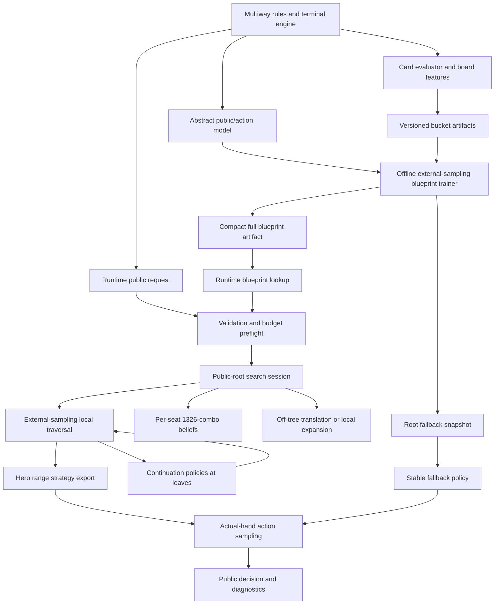

# Document C - Implementation Roadmap

## Pluribus-like multiway poker solver for TexasSolver

**Date:** 2026-08-09  
**Planning horizon:** 90 implementation days  
**Source A:** [Current project state](project_state_report.md)  
**Source B:** [Pluribus technical report](pluribus_technical_report.md)  
**Status:** Engineering roadmap, not a claim that the original Pluribus source or all of its production details are known.

## 1. Purpose and recommended direction

The recommended direction is an incremental evolution of the existing
`games/multiway_*` and `solver/multiway_*` stack. Do not replace the exact HUNL
solver, the established multiway rules and terminal layers, or the existing
sparse/deterministic traversal primitives. The main missing capability is the
integration boundary: `MultiwayResolver` must become a real bounded runtime
search orchestrator instead of applying a bounded perturbation to a static or
blueprint policy.

The target is a structurally Pluribus-like system, not an exact reproduction
of an unavailable production implementation. The target system is:

1. A six-player no-limit Hold'em rules engine with exact terminal settlement.
2. An offline abstract blueprint learned by self-play with sampled CFR.
3. A compact, versioned, read-only blueprint artifact available to runtime
   lookup and continuation evaluation.
4. A runtime public-state search rooted at the current betting round.
5. Per-player private-card beliefs over the 1,326 canonical combinations.
6. A safe bounded policy for actions outside the blueprint abstraction.
7. Current-round high precision and future-street bucket abstraction.
8. Four continuation-policy modes at depth-limited leaves.
9. Strategy export for the hero's full possible range, followed by sampling
   for the actual hero hand.
10. Fixed wall-clock and memory budgets, deterministic worker batching, and
    fallback to a compatible stable policy when a search is incomplete.

The target deliberately excludes poker client automation, screen scraping,
account/session integration, stealth, and external networking. The public
interface remains structured game state in and strategy/diagnostics out.

### 1.1 What must not change

- Preserve `HUNLFlatDCFR` behavior unless a separate task explicitly targets
  it.
- Preserve the exact multiway terminal semantics for fold, showdown, side pots,
  refunds, rake, ties, and odd-chip distribution.
- Keep the library host-owned at its external boundary. The library must not
  retain request cards, ranges, raw seeds, or player identity data after a
  request unless an explicit protected artifact contract requires it.
- Keep the sampled solver CPU-oriented. The Pluribus reference used CPU
  traversal and irregular sparse access, not GPU inference.
- Keep runtime row and graph allocation bounded by preflight checks. Do not
  materialize a complete six-player game tree.
- Keep exact and sampled contracts separate. A `HUNLConfig` field must not
  silently change the behavior of the legacy fixed-private entry point.

### 1.2 What this roadmap does not claim

Document B does not expose the original Pluribus class boundaries, complete
action menus, exact clustering features, exact synchronization design, or
complete serialization format. Where this roadmap specifies an API or file
name not present in Document A, it is a proposed TexasSolver design boundary,
not a claim about Pluribus source code.

The published Pluribus numbers are reference constraints and historical
context. They are not automatic TexasSolver acceptance thresholds. TexasSolver
must first establish reproducible correctness, memory, and latency baselines
on its own hardware and release profile.

## 2. Executive implementation sequence

The shortest safe route is:

```text
baseline and contracts
    -> runtime belief/range session
    -> real traversal integration
    -> full blueprint lookup artifact
    -> current-round search and rerooting
    -> off-tree translation and future buckets
    -> continuation-policy leaf integration
    -> deterministic parallel and memory hardening
    -> evaluation and release migration
```

The critical architectural change is to separate three policy roles that are
currently too close together:

- **Blueprint policy:** broad, persistent, abstract, read-only at runtime.
- **Search-local policy:** mutable regrets and average strategy for one public
  subgame and one bounded request.
- **Fallback policy:** compatible latest root, compatible blueprint, or static
  legal policy.

The resolver should never mutate the loaded blueprint. Each request receives a
search session with its own ranges, local rows, worker deltas, budget, and
diagnostics.

## 3. Analysis of Document A: current implementation

### 3.1 Strong existing foundations to preserve

Document A describes substantial functionality that directly supports the
target. These systems should be treated as foundations, not rewritten.

| Area | Existing implementation | Reuse plan |
| --- | --- | --- |
| Rules | `MultiwayGameRules`, `MultiwayState`, `MultiwayFixedState`, `MultiwayBettingSnapshot` | Preserve rule semantics. Add adapters only where runtime search needs fixed views. |
| Replay | `MultiwayHandHistory`, `MultiwayReplayEvent` | Reuse for deterministic public-state fixtures and range-update replay. |
| Terminal settlement | `build_multiway_pot_layout`, `settle_multiway_terminal`, fixed settlement kernel | Use as the only terminal accounting path. Add differential tests around it. |
| Hand evaluation | Seven-card evaluator integration through multiway showdown | Reuse for terminal values and feature generation. Do not create a second evaluator. |
| Private ranges | `MultiwayPrivateConfig`, `MultiwayCompiledPrivateRanges` | Extend with belief-update and fixed-array views. Preserve allocation-free worker sampling. |
| Action abstraction | `MultiwayActionAbstraction`, `MultiwayPublicBuilder` | Add explicit translation and current-round modes instead of replacing menu generation. |
| Bucket registry | `MultiwayBucketTable`, `MultiwayBucketRegistry`, artifact identity and coverage checks | Retain artifact format and identity checks. Add a future-potential model as a versioned producer. |
| CFR math | `multiway_cfr.hpp` | Reuse reach, sampled/full-tree distinction, regret matching, delta application, and NashConv diagnostics. |
| Sparse storage | `MultiwaySparseRowStorage` | Reuse action-major `[action][bucket]` layout and admission limits. Add a read-only blueprint table beside mutable search rows. |
| Public graph | `MultiwayPublicStateDescriptor`, `MultiwaySolverCoordinator` | Use as the lazy public-state graph owner. Keep private data out of descriptors. |
| Traversal | `MultiwayRootExternalSamplingTraversal`, `MultiwayRootBatchRunner` | Make this the actual runtime search engine behind the resolver. |
| Terminal adapter | `MultiwayTerminalAdapter` | Reuse opaque deal tokens, public chance, street transitions, and terminal dispatch. |
| Continuation | `MultiwayFixedContinuationPolicy`, `multiway_rollout_leaf.hpp` | Integrate into search leaves and preserve fixed scratch ownership. |
| Training | `MultiwayBlueprintTrainingSession`, `MultiwayBlueprintTrainer` | Extend from root-only export toward a compact full blueprint artifact. Keep root export for fallback. |
| Persistence | `MultiwayCheckpoint`, `MultiwayBlueprintArtifacts`, manifests, hashes | Extend identity and storage contracts, not replace atomic writes and verification. |
| Resolver | `MultiwayResolver` validation, fallback, deadline reserve, public audit behavior | Preserve validation and fallback protections. Replace only its static perturbation inference path. |
| Evaluation | `evaluate_multiway_candidates` callback harness | Add runtime-search candidates and policy diagnostics to the existing harness. |
| Profiling | Environment-controlled timers, counters, report files, memory metrics | Instrument each new boundary before optimizing. |

### 3.2 Existing systems that are only partial for the target

The following components exist but do not yet satisfy the full target contract.

1. **Multiway training exists, but the report does not establish a complete
   runtime-loadable full-game blueprint.** The current public snapshot is
   intentionally root-only. A Pluribus-like runtime also needs a compact
   strategy prior for arbitrary reached abstract continuation states.

2. **Multiway root traversal exists as a separate component, but the resolver
   does not invoke it per request.** Current inference starts from a static or
   blueprint policy and applies a bounded deterministic perturbation loop.

3. **Private range sampling exists, but public-state belief updating is not
   described as an integrated per-action Bayes update for every active seat.**
   The target needs fixed-size per-seat reach/posterior arrays and explicit
   strategy-source provenance for each update.

4. **Action abstraction can insert an exact observed off-tree legal action, but
   the pseudo-harmonic translation behavior from Document B is not described as
   implemented.** Translation and expansion need separate, testable policies.

5. **The bucket baseline is deterministic feature hashing with 96/128/192
   buckets by street.** Document B calls for domain-specific potential-aware
   clustering, roughly 200 blueprint buckets after the first round and a richer
   future-search representation, described as roughly 500 future buckets per
   flop in the published system.

6. **Four continuation policy classes and rollout support exist, but the
   report does not state that the search traverser can choose continuation
   policies consistently at abstract information sets.** The leaf boundary is
   currently a callback-owned surface.

7. **Deterministic worker partitioning and merge infrastructure exists, but
   resolver integration, cancellation, and memory-pressure behavior need
   end-to-end validation.** Determinism of a component is not enough if the
   resolver mixes static fallback, deadline expiry, and partial batches.

8. **The evaluation harness exists, but actual match policy, AIVAT, and
   opponent/off-tree evaluation remain callback-owned.** This is useful for
   composition, but it is not yet a complete target validation pipeline.

### 3.3 Important current limitations and assumptions

- The current multiway release profile is stricter than the historical
  Pluribus live hardware profile: warning at 48 GiB, operating cap around
  56 GiB, hard host cap at 60 GiB, 20-second external deadline, 15-second
  resolver deadline, and a 100 ms reserve. These limits should remain the
  default safety envelope for a 64 GB desktop.
- The current baseline bucket artifact is deterministic feature hashing, not
  learned clustering. It is suitable as a correctness baseline but should not
  be represented as the final Pluribus-like information abstraction.
- The resolver retains only the latest compatible root policy. It does not
  retain requests, cards, or ranges. This privacy behavior must remain.
- The production artifact is described as root-only. That is compatible with
  low-memory deployment fallback, but it is insufficient by itself for a
  runtime blueprint lookup layer. The target requires a separate compact
  blueprint representation or an explicit decision to narrow the target.
- The multiway stack supports two through six seats. The Pluribus target is
  six-player. Generality may be retained in common code, but acceptance tests
  must include the six-seat profile.
- Exact HUNL and sampled structured HUNL are separate contracts. The target
  multiway work must not route through the legacy exact fixed-hand API.

### 3.4 Systems that should not be rebuilt

Do not rebuild the following unless tests prove a specific semantic defect:

- no-limit betting legality and `MultiwayState` transitions;
- side-pot layout and terminal settlement;
- canonical private-card enumeration and seven-card hand evaluation;
- the existing sparse action-major row representation;
- the existing coordinator-owned public descriptors;
- worker-local delta streams and deterministic merge ordering;
- checkpoint atomicity, manifests, and hash verification;
- the fixed continuation and fixed terminal scratch primitives;
- exact `HUNLFlatDCFR` and its performance behavior.

### 3.5 Systems that need substantial modification

- `MultiwayResolver`: replace static perturbation inference with a search
  session orchestration path while retaining validation and fallback.
- `MultiwayBlueprintTrainer` and `MultiwayBlueprintArtifacts`: add a compact
  full-blueprint artifact that can answer sparse abstract-state lookups.
- `MultiwayPrivateConfig` and compiled ranges: add belief update semantics,
  action-likelihood application, and fixed per-seat views.
- `MultiwayActionAbstraction`: add explicit abstract menu generation,
  pseudo-harmonic translation, expansion policy, and current-round precision
  modes.
- `MultiwayBucketRegistry`: support versioned future-potential artifacts while
  retaining deterministic baseline artifacts.
- `MultiwayRootExternalSamplingTraversal`: accept blueprint priors, mutable
  search rows, continuation leaf evaluators, search depth boundaries, and
  cancellation/memory limits.
- `MultiwayRootBatchRunner`: expose clean partial-batch semantics and runtime
  budget reporting.
- `MultiwayFixedContinuationPolicy` and rollout leaf: make continuation
  policies usable by the runtime search as a policy choice, not only as a
  standalone evaluator.
- release configuration and runbook: describe the two-tier blueprint artifact
  model and live-search lifecycle.

### 3.6 Systems that should be added

The names below are proposed module boundaries. They are not claimed to
already exist.

- `multiway_range_belief`: fixed `[seat][1326]` beliefs, card masks,
  normalization, Bayes updates, and provenance.
- `multiway_blueprint_store`: read-only sparse blueprint lookup, row decoding,
  action/menu identity, model identity, and memory-mapped or streamed loading
  decision.
- `multiway_blueprint_builder`: full abstract-state training admission,
  snapshotting, pruning, compact serialization, and coverage reports.
- `multiway_search_session`: one runtime public-root context, local rows,
  ranges, actual-hand freeze state, off-tree actions, budget, and export.
- `multiway_search_policy`: blueprint prior, current regret-matched strategy,
  average strategy, fallback, and action sampling semantics.
- `multiway_offtree`: action classification, pseudo-harmonic translation, and
  dynamic current-subgame action insertion.
- `multiway_future_bucket_model`: feature extraction, potential summaries,
  clustering artifact loading, and coverage validation.
- `multiway_leaf_continuation`: information-set-consistent continuation-policy
  selection and leaf value evaluation.
- `multiway_runtime_budget`: deadline, reserve, cancellation, row/graph caps,
  partial-batch status, and fallback policy.
- `multiway_runtime_metrics`: stable counters and structured diagnostics for
  search, ranges, rows, memory, and fallback causes.
- `multiway_policy_evaluation`: deterministic self-play, cross-play, off-tree
  gauntlets, reduced-game NashConv, and optional AIVAT-compatible outputs.

## 4. Target state derived from Document B

### 4.1 Target architecture

The target is a two-stage system with a shared rules/data foundation.



The layers have distinct ownership:

- **Rules layer:** value-like state and validated transitions.
- **Artifact layer:** immutable model data loaded by a host and checked by
  identity/hash.
- **Session layer:** request-local mutable state, never shared across requests.
- **Coordinator layer:** public graph admission, row ownership, and ordered
  merge.
- **Worker layer:** trajectory-local scratch and deltas only.
- **Host layer:** transport, configuration mapping, artifact promotion,
  logging policy, and protected replay storage.

### 4.2 Offline blueprint requirements

The offline trainer must eventually provide:

- six-player abstract game coverage;
- finite legal action menus, normally configured by context rather than hard
  coded as a universal list;
- external-sampling MCCFR or materially equivalent sampled CFR;
- traverser action enumeration and sampled chance/opponent actions;
- multi-player counterfactual reach and utility semantics;
- regret matching and linear average-strategy weighting;
- lazy row allocation;
- compact regrets and strategy values;
- optional negative-regret pruning only after warmup and with periodic full
  traversal retention;
- checkpoint/resume identity validation;
- coverage and unreachable-row reports;
- compact artifact export for runtime lookup.

The offline artifact is a strategy prior and continuation source. It is not a
runtime mutable table.

### 4.3 Runtime nested-search requirements

For each eligible request, runtime must:

1. Validate the `MultiwayBettingSnapshot`, board, hero cards, actor, ranges,
   legal actions, and model identity.
2. Establish the current betting-round boundary.
3. Load a compatible blueprint prior and bucket/action metadata.
4. Initialize per-seat beliefs over legal 1,326 combinations.
5. Reconstruct or admit a public root with the exact observed public state.
6. Classify each observed action as in-tree, translatable off-tree, or a
   candidate for local expansion.
7. Run bounded local external-sampling search with worker-local deltas.
8. Stop cleanly at deadline, memory limit, cancellation, or configured batch
   limit.
9. Export a strategy row for every relevant hero hand or at minimum every
   explicitly requested hero hand, with diagnostics identifying coverage.
10. Select the actual hero-hand row and sample one legal action.
11. Freeze the actual-hand action distribution until the current betting round
    ends, unless a qualifying off-tree event explicitly causes a reroot.
12. Retain only the permitted compatible root fallback state.

### 4.4 Abstraction requirements

The blueprint and runtime must use different precision levels:

- **Blueprint:** finite action abstraction and coarse information buckets.
- **Current live round:** exact public betting sequence and exact current-round
  state where practical, with private-hand identity or a lossless mapping for
  the acting player's current holding.
- **Future streets:** versioned potential-aware buckets and continuation
  policies.

The exact published number of actions and buckets must remain configuration,
not an unverified hard-coded promise. The implementation must support the
reported scale and produce artifact metadata describing the actual profile.

### 4.5 Runtime strategy semantics

The runtime must distinguish:

- current regret-matched strategy used to sample or evaluate actions;
- weighted average strategy used for blueprint output or updates where the
  selected algorithm requires it;
- continuation policy transforms used only below a search leaf;
- fallback policy used when no clean search result is available.

The final action is sampled from the actual hero hand's normalized probability
row. Selecting the maximum probability action is not the target behavior.

## 5. Current-to-target gap analysis

| ID | Current state from A | Target state from B | Gap and required change | Dependencies | Risk |
| --- | --- | --- | --- | --- | --- |
| G1 | `MultiwayResolver` validates, chooses fallback, normalizes, and applies a bounded deterministic perturbation loop. | Runtime nested search runs from the current public root and returns a search-derived hero strategy. | Add a request-local search session and call `MultiwayRootBatchRunner`/traversal from `resolve`. Keep static and blueprint fallback paths. | Runtime contracts, budget layer, traversal integration. | High: changes the main inference behavior. |
| G2 | Multiway trainer and root-only snapshots exist. | Runtime needs a compact blueprint covering reached abstract states, not only one root. | Add a full sparse blueprint store/artifact while retaining root snapshots for fallback and deployment diagnostics. | Stable IDs, serialization schema, training admission. | High: storage and identity design affect every consumer. |
| G3 | Compiled per-seat weighted range sampling exists. | Every active seat needs a belief over legal private combinations, updated after observed actions with strategy likelihoods. | Add fixed-size belief arrays, card-removal masks, Bayes update, normalization, and source provenance. | Canonical combo IDs, strategy lookup. | High: blocker and normalization errors corrupt the search. |
| G4 | Public builder and action abstraction support exact insertion of an observed legal action. | Small off-tree actions can be translated; important deviations are added to the local subgame. | Add action classification, pseudo-harmonic normalized-size translation, expansion thresholds, and identity-preserving menu updates. | Legal action metadata, deterministic IDs. | Medium/High: bad translation can produce systematic strategy errors. |
| G5 | Baseline buckets use deterministic feature hashing with 96/128/192 street profiles. | Blueprint uses domain-specific clustered information abstraction; future live search uses richer potential-aware buckets. | Add feature vectors and versioned learned/constructed artifacts. Keep baseline hashing as a correctness profile. | Hand evaluator, board features, artifact identity. | High: abstraction quality affects strategy and memory. |
| G6 | Four fixed continuation policies and rollout leaf boundary exist. | Leaves use normal, fold-heavy, call-heavy, and raise-heavy continuation choices consistently at information sets. | Integrate continuation policy selection into local traversal and leaf evaluation; add policy-row provenance and normalization tests. | Search leaf contract, future bucket IDs. | High: hidden-information leakage is possible. |
| G7 | Root traversal and deterministic merge components exist separately from resolver. | Every eligible runtime request performs bounded sampled local search. | Define resolver-to-traversal adapter, batch lifecycle, clean result rules, cancellation, and partial-result export. | G1, runtime budget. | High: partial batches can cause nondeterministic or stale output. |
| G8 | Worker deltas carry trajectory IDs and merge deterministically. | Multithreaded search must remain reproducible and avoid floating-point atomics. | Add multi-worker replay tests, fixed-order merge assertions, and no-shared-row mutation checks. | G7, metrics. | Medium. |
| G9 | Release limits and memory preflight exist for the multiway stack. | Online search must honor strict memory and time safety while expanding off-tree states. | Extend estimates to blueprint mapping, per-seat beliefs, local rows, continuation cache, and export buffers; reject before unsafe allocations. | Full artifact format, session storage. | High: paging or overcommit can invalidate the solver. |
| G10 | `MultiwaySparseRowStorage` is mutable Float64 action-major storage. | Blueprint should be compact/read-only; search rows need efficient mutable local storage. | Add separate read-only decoded/packed rows and explicit mutable session rows. Decide Float32/Float64 per role only after error measurements. | Stable row schema, numeric tests. | Medium/High. |
| G11 | Current public descriptors intentionally contain no private or policy state. | Search needs beliefs and private deals while graph remains public. | Keep descriptors public-only; attach session-owned belief/deal views and opaque terminal tokens. | Existing terminal adapter. | Low if boundary is preserved. |
| G12 | Current trainer supports linear weighting, pruning, snapshots, and resume identity. | Blueprint training needs enough full-game coverage and auditable artifact generation. | Add coverage metrics, warmup/pruning policy validation, artifact completeness checks, and restart equivalence tests. | G2, metrics. | Medium/High. |
| G13 | Multiway evaluation is callback-driven. | Target must measure cross-play, reduced-game quality, off-tree behavior, timing, memory, and variance. | Add policy adapters for live resolver, deterministic match fixtures, AIVAT-compatible data outputs, and acceptance reports. | G1, artifact loading. | Medium. |
| G14 | Terminal settlement is implemented for side pots, rake, ties, and odd chips. | Runtime and CFR must use exact multi-player utilities at all terminal paths. | Audit every traversal and continuation leaf against the same terminal adapter; prohibit two-player shortcuts. | Existing terminal tests. | High if duplicated utility logic remains. |
| G15 | CPU and SIMD support exist; no GPU path is required. | Reference uses CPU sparse traversal and compact storage. | Profile actual hot paths, then optimize row math, sampling, lookup, and allocation behavior. Do not start with GPU work. | Correct end-to-end path and profiles. | Medium. |
| G16 | Root-only artifact and latest-root fallback are current release behavior. | Pluribus-like operation needs broad blueprint lookup plus safe fallback. | Adopt dual artifact roles: full compact blueprint for search, root snapshot for fallback/deployment. Update runbook and identity schema. | G2, release migration. | High: artifact incompatibility can silently change policy. |
| G17 | No documented persistent opponent model or network/client integration. | B requires current-state ranges and unsafe self-policy opponent modeling, not identity tracking. | Add only per-hand current-state belief updates. Explicitly keep long-term opponent database and transport out of scope. | G3. | Low. |
| G18 | Exact HUNL, sampled HUNL, and multiway contracts are intentionally separate. | Target is six-player multiway with optional common primitives. | Add explicit target APIs and compile-time/include boundaries. Do not route six-player requests through legacy HUNL APIs. | G1, API review. | Medium. |

## 6. Proposed target modules and data contracts

### 6.1 Public request and response boundary

The existing `MultiwayBettingSnapshot` should remain the authoritative public
state handoff. A target runtime request should contain, conceptually:

```text
MultiwayRuntimeRequest
    rules identity / model identity
    validated MultiwayBettingSnapshot
    public board and street
    actor seat
    hero hole cards, if the caller is resolving the hero's action
    per-seat initial range sources or compiled ranges
    observed action/menu information
    deadline and resource policy
    deterministic request seed
```

The response should contain:

```text
MultiwayRuntimeResponse
    status: solved, partial, fallback, invalid, or rejected
    normalized legal action policy
    sampled action, when sampling is requested and input is valid
    policy provenance: search, blueprint, stable root, static legal
    model identity and public state identity
    trajectory, accepted/discarded, merge, terminal, and leaf counters
    memory and timing diagnostics
    fallback reason, if applicable
```

The exact type name should follow existing naming conventions. The important
contract is that the response contains strategy and diagnostics, not hidden
cards, opponent ranges, raw worker state, or raw private seeds.

### 6.2 `RangeBelief` data model

Recommended runtime representation:

```text
RangeBelief
    weight[1326]             // fixed-size posterior or reach weight
    legal_mask[1326]         // board/dead-card compatibility
    normalized_mass           // explicit diagnostic
    source_kind               // uniform, supplied, blueprint, search
    last_action_id            // optional compact diagnostic
    last_update_revision      // session-local revision
```

For six seats, the session owns six such rows. The 1,326 dimension is bounded,
so a fixed array is preferable to a hash map in the hot path. Legal-card
conflicts must be applied before normalization. If a sampled private deal has
already consumed cards, the corresponding combinations must be excluded from
other seats.

Bayes update contract:

```text
posterior(hand) = prior(hand) * action_probability(hand, observed_action)
posterior(hand) = 0 for illegal or card-conflicting hands
normalize over legal hands
```

The update must record which strategy source produced the action probability:
blueprint, previous search result, translated menu row, or fallback. A
zero-mass posterior is an explicit recoverable condition. The policy must not
silently produce NaNs or reintroduce illegal hands.

### 6.3 Blueprint store contract

The planned compact full blueprint should provide:

- model identity, abstraction identity, rules identity, and schema version;
- stable public-state/action-menu/infoset/bucket IDs;
- sparse lookup for reached abstract public states;
- action-major strategy rows;
- optional current regret rows for offline resume, not required by runtime;
- row normalization and legal-action mask validation;
- continuation lookup for future abstract states;
- coverage/missing-row status;
- artifact hash and source metadata.

The runtime store must be immutable after verification. It may use an indexed
in-memory representation, a compact file-backed representation, or a mapped
representation, but the choice must be benchmarked. The initial 90-day plan
should implement the simplest verified indexed loader first. Do not introduce
memory mapping before row identity, error handling, and lifetime rules are
stable.

### 6.4 Search session contract

A request-local search session should own:

- the immutable artifact references;
- the current public root descriptor;
- per-seat range beliefs;
- current-round boundary and reroot revision;
- local mutable sparse rows;
- worker-local delta buffers;
- actual hero-hand strategy freeze state;
- current menu including expanded off-tree actions;
- terminal and continuation scratch;
- deterministic scheduler state;
- runtime budget and cancellation token;
- export buffers and profile counters.

The session must be destroyed or reset after the request. It must not be
stored in `MultiwayResolver` as a shared mutable object. The resolver may
retain only the compatible stable root policy already permitted by Document A.

### 6.5 Search traversal semantics

The first correct implementation should use the existing external-sampling
shape:

1. Select a traverser among active seats according to an explicit configured
   policy.
2. Sample private deals and chance events with the existing terminal adapter
   and reach semantics.
3. At a non-traverser decision, sample the current strategy or blueprint
   policy. This is the unsafe opponent model.
4. At the traverser's decision, enumerate all legal current actions.
5. At a terminal, call the established multiway terminal path.
6. At a depth-limited leaf, call the continuation evaluator.
7. Apply sampled multi-player regret and average-strategy deltas to worker
   local streams.
8. Merge in fixed worker and trajectory order.

The implementation must preserve the distinction already present in
`multiway_cfr.hpp` between full-tree action values and sampled action values.
The sampling importance ratio must remain explicit. No two-player shortcut may
be introduced for six-seat utility or counterfactual reach.

### 6.6 Off-tree action contract

Classify a legal observed action into:

1. Exact abstract action already present.
2. Small translatable deviation.
3. Important deviation that must be admitted to the current search menu.
4. Invalid action rejected by rules validation.

Translation must operate on normalized action scale and preserve legality. It
must not use only absolute chip distance. The pseudo-harmonic mapping can be a
configuration-backed implementation of the published concept, but the exact
formula and thresholds are an architecture decision and must be versioned.

Expansion must create a deterministic action ID and update all relevant menu
and state fingerprints. It must never mutate the offline blueprint artifact.

### 6.7 Continuation leaf contract

The continuation layer should expose the four policy classes already present:

- normal blueprint;
- fold-biased;
- call-biased;
- raise-biased.

For a legal action row, multiply only the relevant action class by the
configured boost, then renormalize over legal actions. A row with no action of
the requested class remains valid and unchanged. If a continuation policy is
selected strategically, its selection must be associated with an abstract
information set and not with hidden private-card details unavailable to that
player.

The first implementation may evaluate each policy through the existing fixed
rollout boundary. A later optimization may use sampled continuation actions or
compressed policy choices, but semantic tests must remain against the direct
transformation.

## 7. 90-day implementation roadmap

The phases below are ordered by dependency. Each phase should leave the
repository compiling and testable. Validation commands are prescribed work,
not commands executed as part of preparing this document.

## Phase 0 - Preparation, baseline, and contract freeze

**Days:** 1-5

### Objective

Establish reproducible baselines and lock the target contracts before changing
runtime inference. This prevents the new search path from being judged only by
subjective behavior and makes regressions in existing multiway semantics
detectable.

### Why this phase comes now

All later work touches ranges, action menus, public IDs, rows, and resolver
behavior. Without a baseline, a change in output could be caused by a rules
bug, a policy-source change, nondeterministic merge order, or a legitimate
search improvement.

### Current relevant implementation

Document A already provides multiway rules, terminal layers, sparse storage,
root traversal, trainer, artifacts, resolver fallback, evaluation callbacks,
and profiling. The resolver currently does not invoke the full traversal.

### Target state

There is a written contract for request identity, policy provenance, range
semantics, sampling seeds, deadline behavior, memory status, artifact identity,
and deterministic output.

### Tasks

#### P0.1 - Record current resolver and traversal baselines

**Goal:** Capture current behavior without changing it.

**Current behavior:** `MultiwayResolver` uses validation, compatible root or
blueprint fallback, static legal policy, and bounded deterministic adjustment.

**Implementation:** Add a small deterministic fixture set around existing
public request paths. Record normalized policy, sampled action under fixed seed,
status, fallback reason, timing, rows, trajectories, and observed memory. Use
the existing profiling/report mechanism. Include valid, invalid, off-tree, no
artifact, deadline-exhausted, and max-row cases.

**Dependencies:** None.

**Expected result:** A baseline report can distinguish invalid, fallback, and
eligible requests.

**Validation:** Re-run the fixture twice and compare serialized diagnostics and
policy values within the documented floating-point comparison rule.

**Risks / edge cases:** Do not retain hero cards or opponent ranges in the
report. Do not turn diagnostics into a hot-path string allocation.

#### P0.2 - Define target policy provenance and status codes

**Goal:** Make output behavior observable and migration-safe.

**Current behavior:** Resolver diagnostics and fallback states exist but are
not yet sufficient to distinguish a real search from a bounded perturbation.

**Implementation:** Define the conceptual status/provenance set: invalid,
rejected by budget, solved, partial, stable-root fallback, blueprint fallback,
static-legal fallback. Add a search-engine version and artifact identity to
diagnostics. Keep public logs free of private data.

**Dependencies:** P0.1.

**Expected result:** Old and new resolver paths can be compared by provenance.

**Validation:** Unit-test every transition and ensure invalid requests never
sample an action.

**Risks / edge cases:** Avoid treating an incomplete search as fully solved.

#### P0.3 - Freeze model identity inputs

**Goal:** Prevent incompatible rules, action menus, buckets, terminal models,
and code schemas from being mixed.

**Current behavior:** Document A already includes model identity and manifest
verification at artifact boundaries.

**Implementation:** Inventory the identity fields and add explicit components
for range semantics, future bucket model, off-tree policy, continuation policy,
and runtime search schema. Update identity hashing only through one central
path. Do not add ad hoc identity strings inside hot traversal code.

**Dependencies:** P0.1.

**Expected result:** A fixture artifact can be rejected when any relevant
semantic input differs.

**Validation:** Mutate one identity component at a time and assert load failure.

**Risks / edge cases:** Changing identity for a non-semantic diagnostic field
would unnecessarily invalidate all artifacts. Document the inclusion rule.

#### P0.4 - Add a baseline allocation and timing profile

**Goal:** Establish the before-search performance reference.

**Current behavior:** Existing profiling includes stage timers and observed
memory.

**Implementation:** Profile the existing resolver, root traversal in isolation,
private sampling, terminal settlement, row admission, and merge. Capture wall
time, CPU time where available, allocations, peak resident memory, accepted
trajectories, and worker imbalance.

**Dependencies:** P0.1.

**Expected result:** Later optimization claims use comparable workloads.

**Validation:** Store fixture metadata with each profile. Do not compare runs
with different seeds, model identities, or row limits.

**Risks / edge cases:** Debug logging and profiler overhead must be marked in
the report.

### Phase exit condition

Existing behavior is captured by deterministic fixtures, target status and
identity contracts are written, and no architecture change has yet replaced
the resolver.

## Phase 1 - Canonical IDs, range beliefs, and runtime session foundations

**Days:** 6-14

### Objective

Create the fixed-size, allocation-free runtime data model needed by both
blueprint lookup and online search.

### Why this phase comes now

The resolver cannot safely call a real search until it can carry all active
players' legal beliefs, stable action/menu IDs, and a request-local session.
These contracts must be stable before serialization or multithreading changes.

### Current relevant implementation

`MultiwayPrivateConfig` and `MultiwayCompiledPrivateRanges` already provide
canonical private ranges and allocation-free worker sampling. Public state and
action IDs are produced by `MultiwayPublicBuilder` and
`MultiwayActionAbstraction`.

### Target state

Every runtime hand combination, public state, action menu, bucket, and infoset
uses a stable numeric identity. A search session owns six fixed belief rows and
all mutable state for one request.

### Tasks

#### P1.1 - Audit and centralize canonical combination IDs

**Goal:** Guarantee that every module uses the same 1,326 unordered two-card
ID mapping.

**Current behavior:** Canonical private ranges and evaluator utilities exist,
but the target requires the mapping at every runtime belief and policy boundary.

**Implementation:** Identify the existing combo enumeration and expose a single
non-owning lookup/view for card pair to combo ID, combo ID to cards, and legal
mask generation. Add compile-time constants for the bounded count. Replace
duplicate local mappings only where duplication exists. Keep mapping out of
string keys and unordered lookups in hot loops.

**Dependencies:** None beyond existing card utilities.

**Expected result:** Range, terminal adapter, bucket, and export code agree on
combo identity.

**Validation:** Exhaustively round-trip all 1,326 pairs; reject same-card and
out-of-range pairs; compare board-blocked masks with existing canonical range
enumeration.

**Risks / edge cases:** Reversed hole-card order must map to the same unordered
ID. Suitedness and card order must remain available separately when needed.

#### P1.2 - Implement `RangeBelief` fixed-array views

**Goal:** Represent per-seat beliefs without heap allocation in traversal.

**Current behavior:** Compiled weighted ranges support sampling but not a
documented integrated posterior/reach update contract.

**Implementation:** Add a session-owned fixed array for each active seat,
legal/dead-card masking, mass tracking, source metadata, and reset/copy views.
Provide read-only spans to traversal and mutable spans only to the belief
update boundary. Use `double` initially to preserve numerical reference
behavior; evaluate compact storage later from measured error.

**Dependencies:** P1.1.

**Expected result:** A six-seat session can initialize legal ranges and pass
non-owning views to worker code.

**Validation:** Unit-test uniform initialization, supplied weights, zero weights,
board removal, known hero-card removal, duplicate input merging, and total-mass
diagnostics.

**Risks / edge cases:** Never normalize a row containing illegal combinations.
Do not silently turn an empty legal range into a uniform range without an
explicit fallback status.

#### P1.3 - Implement Bayes action-observation updates

**Goal:** Update each active seat's belief after an observed action.

**Current behavior:** Range propagation utilities exist, but an integrated
strategy-likelihood update for all active seats is not described.

**Implementation:** Define an action-likelihood provider that accepts a public
state, seat, combo ID, and observed action identity. It must retrieve a row from
the current search result, blueprint, translated menu row, or fallback. Multiply
prior by likelihood, apply board/card masks, renormalize, and record source
provenance. For a translated action, use the translated menu policy explicitly.

**Dependencies:** P1.1, P1.2, P0.3.

**Expected result:** A replayed public action sequence produces deterministic
per-seat posterior rows.

**Validation:** Use synthetic policies with known likelihoods and compare exact
posterior values. Test zero-likelihood actions, all-zero posterior, fold-outs,
all-in states, and the next-street reset.

**Risks / edge cases:** Updating only one opponent is incorrect for the target.
All active seats whose action was observed must use the correct source; the
hero's own actual action must not be treated as an unknown opponent action.

#### P1.4 - Define session-owned runtime state

**Goal:** Prevent resolver state, blueprint state, and worker state from being
mixed.

**Current behavior:** Resolver retains a compatible latest root, while the
traversal/coordinator owns separate mutable structures.

**Implementation:** Add a request-local session object, using a proposed
`multiway_search_session` module. It references immutable artifacts and owns
beliefs, local rows, public root revision, off-tree menu, actual-hand freeze
state, budget, scratch, and export. The resolver may create and destroy it but
must not retain it across requests.

**Dependencies:** P1.1-P1.3, P0.2.

**Expected result:** Two simultaneous requests cannot share mutable rows,
ranges, seeds, or cancellation state.

**Validation:** Run two sessions with different seeds and ranges in parallel;
assert their outputs are independent. Add ownership assertions for worker
views.

**Risks / edge cases:** Do not use `shared_ptr` or virtual callbacks in hot
loops. Callback ownership at the leaf boundary must be explicit and lifetime
checked.

#### P1.5 - Stabilize public and action identity fingerprints

**Goal:** Make rerooting and off-tree expansion reproducible.

**Current behavior:** `MultiwayPublicBuilder` already produces deterministic
public descriptors and fingerprints.

**Implementation:** Document the canonical serialization of public state,
history, legal menu, action target contribution, street, active seats, and
board. Ensure an inserted action changes the menu/state identity deterministically.
Use integer IDs after admission and keep the canonical bytes only at the cold
boundary.

**Dependencies:** Existing public builder; P0.3.

**Expected result:** Same request and seed generate identical root and child IDs
across worker counts.

**Validation:** Golden fingerprints for representative preflop, flop, turn,
river, side-pot, all-in, and off-tree states.

**Risks / edge cases:** A field omitted from the fingerprint can merge distinct
betting states. A diagnostic-only field included in the fingerprint can break
artifact compatibility unnecessarily.

### Phase exit condition

The repository has a tested six-seat fixed belief model, deterministic action
and public IDs, and an isolated request-local session. No live resolver behavior
has changed yet.

## Phase 2 - Real traversal integration behind a feature flag

**Days:** 15-25

### Objective

Connect the existing `MultiwayRootBatchRunner` and
`MultiwayRootExternalSamplingTraversal` to a resolver-owned search session,
while keeping the old resolver path available for differential comparison.

### Why this phase comes now

The core traversal, coordinator, terminal adapter, sparse rows, and deterministic
merge already exist. The highest-value missing change is orchestration, not a
new CFR implementation.

### Current relevant implementation

The current resolver does not instantiate the root batch runner. The traversal
already samples deals/chance/opponent actions, enumerates traverser actions,
admits visited public states and rows, and merges worker streams.

### Target state

An eligible request can run a real bounded local traversal behind a feature flag.
The old path remains available as a fallback and differential oracle.

### Tasks

#### P2.1 - Define resolver-to-traversal adapter

**Goal:** Convert validated request/session data into the existing traversal
input without exposing private state in public descriptors.

**Current behavior:** Traversal receives coordinator-bound private sampling and
public state machinery, but resolver integration is absent.

**Implementation:** Add an adapter that supplies rules, snapshot, compiled ranges,
seed schedule, bucket registry, action abstraction, leaf callback, row limits,
and budget. Bind private-deal tokens to the session/coordinator. Pass fixed
belief views and a policy-source provider. Keep the adapter cold at request
setup; traversal receives numeric views.

**Dependencies:** P1.2-P1.4, P0.3.

**Expected result:** A single deterministic batch can be run from a resolver
request without modifying the global resolver or artifact.

**Validation:** Compare adapter-created roots with direct traversal fixture
roots. Assert coordinator ownership for every private token.

**Risks / edge cases:** A token from one coordinator must be rejected by
another. A missing leaf evaluator must stop at a declared boundary, not call
an uninitialized callback.

#### P2.2 - Implement runtime budget and clean-batch semantics

**Goal:** Make deadline behavior safe and reproducible.

**Current behavior:** Resolver has deadline reserve and bounded batch settings;
traversal has batch outputs but not a complete resolver result policy.

**Implementation:** Add a budget object with external deadline, internal
deadline, reserve, max trajectories, max batches, max rows, max values, and
cancel state. Check the budget at batch boundaries and at bounded traversal
points. A batch is clean only after all workers join and its deltas are merged.
Export the latest clean root; discard incomplete worker streams. Return partial
only when at least one clean batch completed.

**Dependencies:** P2.1.

**Expected result:** Deadline expiry cannot expose half-merged rows or leave
worker threads running.

**Validation:** Use artificial short deadlines and deterministic pauses. Assert
all workers join, no incomplete deltas are merged, and fallback is selected when
zero clean batches complete.

**Risks / edge cases:** Checking the deadline only at the end can exceed the
reserve. Checking it in every inner arithmetic operation can destroy throughput.
Use bounded checkpoints.

#### P2.3 - Wire worker-local deltas into session rows

**Goal:** Ensure runtime search mutates only request-local rows through the
existing deterministic merge boundary.

**Current behavior:** Worker streams and coordinator merge infrastructure exist.

**Implementation:** Connect sampled regret and average-strategy deltas to the
session's local rows. Ensure rows are admitted before delta application,
worker code never writes coordinator rows, and merge order is worker index then
trajectory ID. Expose accepted/discarded/merged counts.

**Dependencies:** P2.1, P2.2.

**Expected result:** Repeated runs with identical request, seed, worker count,
and budget produce identical rows and policy export.

**Validation:** Compare one-worker and multi-worker values under a deterministic
fixture. The exact numeric comparison rule must be documented; if worker count
changes the floating-point order, report it rather than calling it deterministic
without qualification.

**Risks / edge cases:** Do not introduce floating-point atomics or shared
`push_back` without reservation in traversal loops.

#### P2.4 - Add resolver feature flag and shadow mode

**Goal:** Compare real search against the current resolver without changing
default behavior.

**Current behavior:** Current path is the only resolver inference path.

**Implementation:** Add host-configured mode: legacy static, search shadow,
search active, or forced fallback. In shadow mode run the search when budget
allows, discard its sampled action, and record policy divergence, rows, memory,
and timing without logging private data. The feature flag must be part of model
identity for artifacts only if it changes policy semantics.

**Dependencies:** P2.2-P2.3.

**Expected result:** The new engine can be observed before it controls output.

**Validation:** Shadow and legacy paths both return valid legal rows. Compare
policy divergence over fixed fixtures and confirm legacy output is unchanged.

**Risks / edge cases:** Shadow work can double latency and memory. It must be
disabled by default outside controlled evaluation.

#### P2.5 - Replace bounded perturbation only for eligible requests

**Goal:** Make real traversal the active path for a controlled subset.

**Current behavior:** Eligible requests use static/blueprint policy plus a
bounded deterministic perturbation loop.

**Implementation:** When validation, artifact, budget, bucket, and range
preflight all pass, run the search session. If the search cannot produce a
clean batch, use the existing fallback chain. Keep invalid requests on the
existing no-sampled-action behavior.

**Dependencies:** P2.1-P2.4.

**Expected result:** Resolver diagnostics show `search` or `partial` only when
real traversal produced the policy.

**Validation:** End-to-end fixture with one batch must show traversal counters
greater than zero, not only policy perturbation counters. Legacy mode remains
available and passes P0 regression fixtures.

**Risks / edge cases:** Do not call a search result compatible merely because
the action menu matches. Validate model identity, board, street, rules, bucket
version, and public state.

### Phase exit condition

The resolver can run real sampled root traversal behind a controlled mode,
returns only clean-batch results, and retains the old path as a differential
oracle. Existing exact HUNL behavior remains untouched.

## Phase 3 - Full blueprint training and runtime lookup artifact

**Days:** 26-38

### Objective

Turn the existing training and root export components into a two-tier artifact
system: a compact full blueprint for search and continuation lookup, plus a
root-only snapshot for stable fallback and deployment diagnostics.

### Why this phase comes now

Real runtime search needs a prior at arbitrary reached abstract states. Without
it, the resolver is only a local learner with static fallback and cannot match
the blueprint-plus-search architecture in Document B.

### Current relevant implementation

`MultiwayBlueprintTrainingSession`, `MultiwayBlueprintTrainer`,
`MultiwayBlueprintSnapshot`, `MultiwayCheckpoint`, and
`MultiwayBlueprintArtifacts` already provide training composition, root export,
atomic writes, manifest/hash verification, and resume identity checks.

### Target state

The trainer can generate a sparse abstract-state blueprint artifact, serialize
it compactly, verify it, and serve read-only rows to runtime. Root snapshots
remain available for fallback. The artifact records actual action/bucket
profiles rather than assuming Pluribus constants.

### Tasks

#### P3.1 - Define full blueprint row and index schema

**Goal:** Specify what a runtime lookup row contains and how it is found.

**Current behavior:** Root snapshots are intentionally root-only; full runtime
lookup schema is not described.

**Implementation:** Define a compact index key made from stable public state or
abstract node ID, acting seat/context, bucket or private-hand abstraction,
action-menu ID, and model identity. Store action-major strategy values and
legal-action metadata. Separate index records from row payloads so missing rows
are detectable. Decide whether offline regrets are stored only in checkpoints
and runtime artifacts contain strategy only.

**Dependencies:** P1.5, P2.3.

**Expected result:** A row can be looked up, normalized, and traced back to an
artifact identity without a string key.

**Validation:** Round-trip synthetic sparse rows, missing rows, duplicate keys,
illegal action masks, truncated payloads, and version mismatch.

**Risks / edge cases:** A row keyed only by public board is insufficient when
betting history, active seats, or menu differs. Keep the key definition explicit.

#### P3.2 - Add trainer row admission and coverage metrics

**Goal:** Make full-blueprint generation measurable.

**Current behavior:** Trainer supports deterministic batches, weighting, pruning,
and root export, but full artifact coverage is not established.

**Implementation:** Add counters for visited public descriptors, admitted rows,
row/action counts, missing lookup requests, per-street coverage, per-seat
coverage, pruned actions, retained full traversals, and terminal/leaf counts.
Emit a coverage manifest without private cards. Keep rows sparse and admit only
reached abstract information sets.

**Dependencies:** P3.1.

**Expected result:** Training can report whether a runtime request is covered by
the blueprint rather than silently falling to a static policy.

**Validation:** Small deterministic training run must produce identical row
keys and counts on resume. Compare row count against a known bounded fixture.

**Risks / edge cases:** Coverage counts must distinguish a missing state from a
legal state whose strategy row is intentionally uniform.

#### P3.3 - Implement compact strategy export and verified load

**Goal:** Persist a full blueprint without retaining dense global tables.

**Current behavior:** Artifact verification exists for root snapshots.

**Implementation:** Extend the artifact boundary with a full-blueprint payload,
index, schema, model identity, abstraction identity, row count, and hash.
Write atomically with a manifest. Load into an immutable store, validate index
ordering, bounds, action masks, row normalization, and hash. Keep root snapshot
as a separate payload/source type.

**Dependencies:** P3.1-P3.2, P0.3.

**Expected result:** Runtime can load a verified full blueprint and use a
compatible root snapshot as fallback.

**Validation:** Round-trip artifact files; corrupt index, payload, manifest,
model identity, and hash independently. Verify known-good fallback selection.

**Risks / edge cases:** Do not silently accept a partial artifact as complete.
Define whether partial coverage is permitted and expose missing-row status.

#### P3.4 - Add blueprint policy provider to runtime traversal

**Goal:** Use the full blueprint as an unsafe opponent model, prior, and leaf
continuation source.

**Current behavior:** Resolver falls back to blueprint/static policy, but root
traversal is not using an arbitrary-state lookup provider.

**Implementation:** Add a read-only policy provider that resolves a row by
public/infoset/bucket/menu identity. On a missing row, return explicit miss
metadata and use the configured fallback. Keep current search rows separate.
The provider must be callable from worker traversal without locks or string
lookups.

**Dependencies:** P3.3, P2.3.

**Expected result:** Non-traverser actions can sample blueprint/current policy
at reached abstract states; leaf evaluation can request blueprint continuation.

**Validation:** Synthetic provider tests for hit, miss, incompatible row, and
fallback. Compare a traversal using a known uniform blueprint against an
equivalent direct policy fixture.

**Risks / edge cases:** A missing row must not be treated as a valid zero row.
Rows must be normalized against the current legal menu.

#### P3.5 - Add checkpoint/resume equivalence for full artifacts

**Goal:** Ensure long offline training can be resumed without changing model
semantics.

**Current behavior:** Checkpoint resume identity exists for the current trainer.

**Implementation:** Include schedule hash, seed policy, iteration weighting,
action abstraction, bucket model, terminal model, pruning settings, and code
schema in resume identity. Store deterministic iteration and trajectory state.
Add conversion from checkpoint rows to runtime strategy artifact only after a
clean checkpoint.

**Dependencies:** P3.1-P3.3.

**Expected result:** Resume plus remaining iterations produces the same result
as one uninterrupted deterministic fixture run.

**Validation:** Split a fixed training run at multiple iteration boundaries and
compare root and full artifact rows.

**Risks / edge cases:** Floating-point merge order and snapshot scheduling can
make bitwise equality impossible. Define tolerance and report ordering policy.

### Phase exit condition

A verified compact full blueprint can be generated and loaded, while the
existing root snapshot remains a separate compatible fallback. Runtime
traversal can request blueprint rows at arbitrary reached abstract states.

## Phase 4 - Runtime nested search lifecycle, rerooting, and hero strategy

**Days:** 39-50

### Objective

Implement the live hand lifecycle: create a root at a betting-round boundary,
search a full hero range strategy, freeze the actual hand within a round, update
beliefs after observed actions, and reroot on the next street or qualifying
deviation.

### Why this phase comes now

The real traversal and blueprint provider now exist. The next missing Pluribus
property is not another isolated solver but the temporal relationship between
public state, ranges, search results, and actual-hand action sampling.

### Current relevant implementation

Document A has public state snapshots, replay, root traversal, terminal adapter,
range sampling, and resolver fallback, but not a full resolver-managed nested
search lifecycle.

### Target state

Each current betting round owns one search context. A new public card creates a
new context with updated ranges. The hero's actual-hand row is sampled and then
frozen within the round unless a configured off-tree event causes a reroot.

### Tasks

#### P4.1 - Implement current-round root construction

**Goal:** Build a search root from the start of the current betting round.

**Current behavior:** Root descriptors can be admitted, but resolver behavior
does not establish a nested-round lifecycle.

**Implementation:** From `MultiwayBettingSnapshot`, identify street, round
boundary, active seats, pot/contributions, public board, action menu, and
current ranges. Create a root revision with blueprint prior and session-owned
beliefs. Ensure hidden prior action is represented by the snapshot/range input
without inventing unavailable history.

**Dependencies:** P1.2-P1.5, P2.1, P3.4.

**Expected result:** Same public snapshot and range state produce the same root
identity and initial strategy provider.

**Validation:** Root fixtures for preflop, flop, turn, river, multiple folded
seats, all-in seats, and an action after an off-tree insertion.

**Risks / edge cases:** Current-round boundary must not discard legal betting
history needed for no-limit raise legality.

#### P4.2 - Implement per-hand strategy export

**Goal:** Export a strategy row for the hero's possible hands, then select the
actual hero hand.

**Current behavior:** Resolver returns a normalized action policy but does not
run full range-wide local search.

**Implementation:** After clean batches, map each relevant hero combo to the
current public state and bucket/infoset row. Export a compact range-wide
diagnostic only when requested; always retain the actual hero-hand row needed
for action sampling. Normalize against the exact legal action menu. If the
actual hand is blocked or absent, return a validation/fallback status.

**Dependencies:** P4.1, P3.4.

**Expected result:** Search output is an imperfect-information strategy over
possible hero holdings, not a solver run only for the known hand.

**Validation:** Synthetic two-hand range fixture where each combo has a known
row. Verify selected hero row and normalized action support.

**Risks / edge cases:** Do not accidentally use the actual hero cards when
computing opponent beliefs or hypothetical hero rows in a way that leaks
private information into shared public nodes.

#### P4.3 - Implement actual-hand freeze within a round

**Goal:** Prevent repeated re-search from changing the already selected hero
hand policy within the same round.

**Current behavior:** No documented integrated freeze behavior in resolver.

**Implementation:** Store actual hero combo ID, root revision, normalized row,
and freeze scope in the session. After the hero acts, retain that row through
the current round. Continue updating other players' beliefs and evaluating
hypothetical rows. Clear the freeze at street transition or qualifying
reroot.

**Dependencies:** P4.2.

**Expected result:** The actual-hand distribution remains stable within the
configured round while the session can still reason about other hands.

**Validation:** Replay a round with multiple opponent actions and assert the
hero's frozen row is unchanged unless an explicit reroot event occurs.

**Risks / edge cases:** Freezing all hero range rows would break belief and
counterfactual calculations. Freeze only the actual selected hand's action row.

#### P4.4 - Implement observed-action range updates

**Goal:** Update all relevant beliefs after each observed opponent action.

**Current behavior:** Range propagation primitives exist, but the nested search
lifecycle does not connect them to current and previous policy sources.

**Implementation:** On observed action, select the strategy source that was
active at that public state. Apply `RangeBelief` Bayes update, then advance the
public snapshot. If action is translated, update using translated semantics;
if expanded, use the search menu row. Preserve source revision in diagnostics.

**Dependencies:** P1.3, P4.1-P4.3, Phase 5 off-tree contracts may be stubbed
with exact-action mode first.

**Expected result:** Range state evolves consistently with the same policy that
was exposed to the public state.

**Validation:** Deterministic replay with hand-conditioned action rows and
known posteriors. Compare updates before and after a street transition.

**Risks / edge cases:** Avoid updating on private internal sampled actions that
were not observed publicly. Preserve mass diagnostics after folded/all-in seats.

#### P4.5 - Implement street transition and reroot lifecycle

**Goal:** Start a new nested search when public information changes materially.

**Current behavior:** State and street transitions exist in rules and terminal
adapter, but not in a resolver search session.

**Implementation:** At street transition, clear current-round freeze, update
board masks and chance reach, retain valid per-seat beliefs, create a new root
revision, and select the new current/future bucket profiles. At a qualifying
off-tree action, reconstruct from the beginning of the current round with the
expanded menu.

**Dependencies:** P4.1-P4.4, Phase 5 for final off-tree classification.

**Expected result:** Flop, turn, and river requests never reuse an incompatible
root or stale actual-hand row.

**Validation:** Full-hand replay through all streets, including fold terminal,
all-in runout, and side-pot showdown. Assert root revisions and model identity.

**Risks / edge cases:** A public-card transition must not reintroduce blocked
private combinations. Reroot must not retain stale worker deltas.

### Phase exit condition

The resolver performs a real nested search lifecycle for controlled fixtures,
exports range-aware hero policy, freezes the actual hand correctly, updates
beliefs, and reroots at street boundaries.

## Phase 5 - Action abstraction, off-tree handling, and future information model

**Days:** 51-62

### Objective

Make the runtime search robust to legal actions outside the blueprint and
replace the baseline-only information abstraction with a versioned path toward
potential-aware future buckets.

### Why this phase comes now

The runtime lifecycle is meaningful only if it can process real legal actions
that are absent from the offline menu. Future bucket changes also affect row
identity and continuation semantics, so they must follow stable session and
artifact contracts.

### Current relevant implementation

`MultiwayActionAbstraction` supports contextual menus and exact insertion of
observed off-tree legal actions. `MultiwayBucketTable` and registry use
deterministic feature hashing with standard 96/128/192 profiles.

### Target state

Small deviations can use a deterministic normalized-scale translation. Important
deviations expand the local public subgame. Current-round search preserves
concrete state detail. Future streets use versioned feature/bucket artifacts,
with the baseline hash retained as a correctness profile.

### Tasks

#### P5.1 - Define abstract action menu profile by context

**Goal:** Make action abstraction explicit and reproducible.

**Current behavior:** Contextual sizing modes and templates exist.

**Implementation:** Version the menu policy by street, active-player count,
position context, unopened/facing-open/facing-three-bet state, pot-relative
templates, minimum raise, all-in, and stack cap. Ensure the generated menu is
legal in the exact `MultiwayState`. Store menu ID and action target
contribution, not only a nominal percentage.

**Dependencies:** P1.5, existing action abstraction.

**Expected result:** Offline and runtime actions use the same explicit menu
identity, and nominal sizing never bypasses legality.

**Validation:** Exhaustively test minimum raise, short raise, all-in, multiway
callers, unopened pot, and no-raise states. Compare repeated menu generation.

**Risks / edge cases:** Different legal actions can share a nominal size but
have different target contributions. Identity must include exact target.

#### P5.2 - Implement pseudo-harmonic translation boundary

**Goal:** Handle small legal off-tree actions without pretending the exact action
was in the blueprint.

**Current behavior:** Exact observed action insertion is available; translation
is not established.

**Implementation:** Add a cold-path classifier that computes normalized action
scale, compares it with the configured abstract menu, and maps to a nearby
abstract action using a versioned pseudo-harmonic rule. Keep original observed
action metadata in the session, but use translated action identity only for the
blueprint policy lookup. Never translate an invalid action.

**Dependencies:** P5.1, P0.3.

**Expected result:** Small deviations update beliefs and policy through a
deterministic translated action source.

**Validation:** Monotonicity and boundary tests around every abstract action;
minimum-raise and all-in cases; compare against a hand-calculated reference
for the chosen formula.

**Risks / edge cases:** Document B does not specify one exact formula or
threshold. Keep the formula and threshold configurable and identity-bound.

#### P5.3 - Implement important-deviation local expansion

**Goal:** Add important off-tree legal actions to the current subgame.

**Current behavior:** Exact insertion exists in public abstraction.

**Implementation:** Define configurable expansion conditions based on normalized
deviation size, player count, street, current budget, and menu importance. Insert
the exact action into the session-local menu, regenerate deterministic public
IDs, and rerun search from the current-round root. The offline blueprint must
remain immutable. Preserve the original action in public history and use exact
action semantics for subsequent range updates.

**Dependencies:** P5.1, P5.2, P4.5.

**Expected result:** A large or strategically important off-tree action becomes
an explicit branch in the local search.

**Validation:** Run a fixture with one off-tree bet and verify that the search
menu contains it, policy rows normalize over it, and root revision changes.
Compare exact insertion against the existing public builder.

**Risks / edge cases:** Expansion can exceed row/memory limits. Preflight before
admission and fall back without partially mutating the session.

#### P5.4 - Add current-round lossless key mode

**Goal:** Preserve the concrete current betting round in live search.

**Current behavior:** Public descriptors retain public state and history, but
bucket model profiles are the baseline deterministic street buckets.

**Implementation:** Add a session mode where current-round public betting
history, exact target contributions, active seats, and actual current board are
part of the public key. Private-hand rows use exact combo IDs where the search
contract requires them, or a lossless explicit mapping. Future street portions
remain bucketed. Keep the graph public-only and attach private beliefs outside
the descriptor.

**Dependencies:** P1.5, P4.1, P5.1.

**Expected result:** The action currently being decided is not merged solely by
coarse bucket or nominal bet size.

**Validation:** Construct states differing by one prior raise or target
contribution and assert distinct IDs and legal menus. Verify equivalent
canonical states merge only when all strategy-relevant fields match.

**Risks / edge cases:** Lossless keys increase graph size. Apply row/graph
preflight and keep future compression enabled.

#### P5.5 - Add potential-aware future feature interface

**Goal:** Create the required input surface for future buckets without inventing
an undocumented production feature set.

**Current behavior:** Baseline features cover board masks, ranks, pairs,
suitedness, and board matches.

**Implementation:** Add a versioned feature provider for current hand strength,
draw/future potential summaries, blocker/card-removal information, board rank
and suit texture, and relevant public context. Keep feature extraction outside
hot traversal loops and cache by canonical board/combo. The feature vector
must be serializable for offline clustering diagnostics.

**Dependencies:** P1.1, existing evaluator, P0.3.

**Expected result:** Future bucket generation can consume richer domain-specific
features while baseline hash remains available.

**Validation:** Feature determinism, board-blocked hands, suit-isomorphic boards,
known draw fixtures, and evaluator agreement for current strength.

**Risks / edge cases:** Future potential must not use unavailable opponent cards
or actual hero identity when generating shared bucket data.

#### P5.6 - Add versioned future bucket artifact producer/consumer

**Goal:** Support richer future buckets and preserve reproducibility.

**Current behavior:** Registry loads deterministic artifact tables and validates
coverage.

**Implementation:** Add an offline producer boundary that can cluster feature
vectors using a documented deterministic algorithm. The specific k-means and
potential-distance configuration must be recorded in artifact metadata. Add a
consumer path that selects future buckets by street and canonical board. The
first 90-day implementation may use a deterministic offline clustering tool
with the baseline feature provider; it must not perform clustering during live
requests.

**Dependencies:** P5.5, P0.3.

**Expected result:** A future bucket artifact can be built, verified, and loaded
by runtime without changing code or using runtime randomness.

**Validation:** Artifact round-trip, deterministic cluster IDs with fixed seed,
coverage of all valid board/combo pairs, invalid bucket rejection, and baseline
versus clustered lookup comparison.

**Risks / edge cases:** Document B describes k-means and Earth Mover's Distance
conceptually but does not specify all features or initialization. Do not claim
scientific equivalence until an evaluation demonstrates it.

### Phase exit condition

The live system can translate or expand legal off-tree actions, distinguish
current-round states losslessly, and load a versioned future bucket artifact.
The deterministic bucket hash remains a tested fallback/reference profile.

## Phase 6 - Continuation policies and depth-limited search integration

**Days:** 63-70

### Objective

Make depth-limited leaves useful and information-set consistent by integrating
the existing four continuation policies into the local search.

### Why this phase comes now

Continuation semantics depend on the blueprint store, future bucket model,
current-round root, and leaf budget. Implementing them earlier would create
interfaces that later change when the runtime lifecycle and future buckets are
added.

### Current relevant implementation

`MultiwayFixedContinuationPolicy` provides blueprint, fold-biased, call-biased,
and raise-biased transforms. `multiway_rollout_leaf.hpp` provides bounded fixed
state rollouts and exact/capped runout behavior through caller-owned scratch.

### Target state

At a leaf, the solver evaluates a compact set of continuation assumptions and
uses a strategy-consistent policy selection. It never reads hidden information
that the acting player cannot observe.

### Tasks

#### P6.1 - Formalize continuation policy row transformation

**Goal:** Establish one scalar reference implementation.

**Current behavior:** Fixed continuation policy transformations exist.

**Implementation:** Define legal-action classification for fold, call/check,
and raise/bet/all-in. Apply the configured multiplier only to the selected
class and renormalize. Define behavior for absent classes, zero rows, and
invalid menus. Return values in the same utility units as the terminal layer.

**Dependencies:** P3.4, P5.1.

**Expected result:** All continuation modes produce legal normalized rows and
identical results across direct and fixed-state paths.

**Validation:** Unit tests for every action-class combination and empty class;
compare to direct hand-computed rows.

**Risks / edge cases:** "Call" and "check" may be distinct action IDs but the
policy-class convention must be explicit and versioned.

#### P6.2 - Implement information-set-consistent continuation selection

**Goal:** Prevent a leaf from selecting continuation mode using hidden hand
information.

**Current behavior:** Four policies exist as callable transforms, but selection
integration is not documented.

**Implementation:** Define a continuation policy selector keyed only by the
leaf public state, acting seat/context, and abstract future information set.
If the first implementation uses a fixed configured mixture, expose the mode
as a public configuration and record it in model identity. If the selector is a
learned/search-local action, store its regret/strategy row in the same abstract
information-set namespace and update it with the same reach semantics.

**Dependencies:** P6.1, P5.6, P3.1.

**Expected result:** Two indistinguishable hands cannot choose different
continuation modes solely because of hidden cards unavailable at that set.

**Validation:** Construct identical public/future bucket leaves with different
private combos and compare continuation-mode distributions.

**Risks / edge cases:** A feature derived from actual hero cards can leak private
information if placed in the public policy key.

#### P6.3 - Integrate rollout leaf into traversal

**Goal:** Replace unresolved depth cutoffs with typed continuation values.

**Current behavior:** Rollout leaf is a callback-owned boundary, while runtime
resolver does not run the full search.

**Implementation:** Pass public state, exact sampled private deal where allowed,
range/bucket reach, utility units, deadline, abstraction version, model version,
and caller-owned scratch into the leaf evaluator. Select continuation mode
through P6.2, evaluate bounded future actions/runouts, and return a populated
value or a declared invalid/capped status. If the leaf cannot complete within
budget, stop at the last clean batch and use fallback policy.

**Dependencies:** P6.1-P6.2, P2.2, P4.1.

**Expected result:** The traversal has no untyped depth-limit escape path.

**Validation:** Exact all-in runout fixtures, capped random runout fixtures,
invalid-context fixtures, and utility-unit consistency against terminal
settlement.

**Risks / edge cases:** Per-terminal dense showdown matrices are prohibited in
the sampled path unless a bounded cache estimate proves safe. Reuse fixed
scratch.

#### P6.4 - Add continuation cache and variance diagnostics

**Goal:** Measure whether leaf estimates are stable before optimizing them.

**Current behavior:** Existing rollout path supports seeded sampling and fixed
scratch, but integrated variance reporting is not established.

**Implementation:** Cache only bounded canonical public/future bucket contexts.
Record seed, runout mode, sample count, policy mode, leaf count, invalid/capped
count, and repeated-seed variance in diagnostics without storing private cards
in public logs. Keep cache ownership request-local unless artifact semantics are
explicitly designed.

**Dependencies:** P6.3.

**Expected result:** Search profiles show whether leaves or traversal dominate
time and whether continuation modes differ materially.

**Validation:** Repeated same-seed equality, different-seed variance report,
cache hit/miss correctness, and memory cap behavior.

**Risks / edge cases:** A cache key missing ranges, public betting history, or
continuation model identity can reuse a value in the wrong context.

### Phase exit condition

Depth-limited search uses four tested continuation semantics, respects
information-set consistency, and reports leaf quality and budget outcomes.

## Phase 7 - Performance, memory, and deterministic parallel hardening

**Days:** 71-78

### Objective

Optimize only after the correct end-to-end path exists. Bring runtime behavior
within the documented 64 GB safety profile and make multithreaded execution
predictable.

### Why this phase comes now

Earlier phases deliberately prioritize semantics and observability. Optimizing
before the resolver invokes real search would measure the wrong workload.

### Current relevant implementation

Document A provides action-major sparse rows, fixed state/scratch kernels,
memory preflight, deterministic schedulers, SIMD row operations, profiling, and
release caps.

### Target state

The runtime does not allocate in per-action/per-bucket hot loops, does not use
strings or hash maps in traversal kernels, respects memory preflight and
runtime caps, and produces reproducible results under configured deterministic
worker scheduling.

### Tasks

#### P7.1 - Establish end-to-end search profile checkpoints

**Goal:** Identify actual bottlenecks.

**Current behavior:** Component-level profiling exists; integrated search profile
is new.

**Implementation:** Profile private deal sampling, public chance, action-menu
generation, public graph admission, row lookup, regret matching, terminal
settlement, continuation leaves, delta merge, and export. Capture CPU time,
wall time, memory, allocations, cache/branch data if available, and worker
imbalance. Use fixed workloads at one, configured, and maximum worker counts.

**Dependencies:** Phases 2-6.

**Expected result:** A bottleneck ranking based on measured time and memory.

**Validation:** Store baseline profiles before every optimization change.

**Risks / edge cases:** Profiling can change scheduling. Mark profiling mode
and repeat a non-profiled run for latency conclusions.

#### P7.2 - Remove hot-path dynamic allocation and textual lookup

**Goal:** Apply the repository hot-path rules to the new integration.

**Current behavior:** Existing fixed kernels are designed for this, but new
resolver bridges may introduce allocations or strings.

**Implementation:** Pre-size worker delta buffers, public node/row admission
capacity, continuation scratch, and export buffers. Convert policy lookup to
stable integer IDs and contiguous row spans. Keep formatting and logging at
cold boundaries. Use fixed arrays for six-seat beliefs and small action menus.

**Dependencies:** P1-P6, P7.1.

**Expected result:** No `std::string`, heap allocation, `std::function`, or
hash-map lookup appears inside per-action/per-bucket traversal loops.

**Validation:** Allocation counters and code review of hot functions. Compare
policy values and counters before/after.

**Risks / edge cases:** Over-reserving can violate the memory budget. Tie each
large reservation to preflight estimates.

#### P7.3 - Complete memory preflight and staged admission

**Goal:** Reject unsafe requests before allocation and degrade gracefully when
the search grows.

**Current behavior:** Memory preflight covers graph/cache, rows, sparse values,
terminal cache, worker deltas, exports, and observed memory.

**Implementation:** Add full blueprint index/reference cost, six range rows,
future bucket cache, off-tree menu growth, continuation scratch, and worst-case
worker buffers. Check warning at 48 GiB, operating cap around 56 GiB, and hard
rejection before 60 GiB under the release profile. Use staged admission: root,
rows, deltas, optional continuation cache. Stop before unsafe expansion.

**Dependencies:** P3.3, P6.4, P7.1.

**Expected result:** A request is rejected or falls back before paging or
overcommit is likely.

**Validation:** Synthetic maximum row/off-tree/worker configurations; compare
estimated and observed memory; assert no allocation after hard rejection.

**Risks / edge cases:** Resident memory can exceed allocator estimates because
of runtime overhead. Keep a safety margin and use observed high-water marks.

#### P7.4 - Validate deterministic worker scheduling and merge

**Goal:** Make reproducibility an explicit acceptance property.

**Current behavior:** Scheduler partitions trajectories deterministically and
worker deltas retain trajectory IDs.

**Implementation:** Add run mode that fixes worker count, trajectory partition,
seed derivation, action sampling, public chance order, and merge order. Assert
that workers never mutate shared rows. Expose a relaxed throughput mode only if
it is clearly marked non-bitwise-deterministic.

**Dependencies:** P2.3, P7.1.

**Expected result:** Identical deterministic runs produce identical policy and
diagnostic streams for the same configuration.

**Validation:** Repeat 1, 2, 4, and configured worker runs. Compare exact
serialized merge streams where ordering is defined and toleranced policy values
where floating-point implementation differs.

**Risks / edge cases:** Parallel floating-point reduction order can change low
bits. Do not hide this under the word deterministic.

#### P7.5 - Optimize row math only after profile evidence

**Goal:** Use existing SIMD kernels where regret/strategy arithmetic is hot.

**Current behavior:** Scalar, SSE2, AVX2, and sampled action-major kernels exist.

**Implementation:** Add scalar reference and selected SIMD dispatch for measured
hot loops: regret matching, average accumulation, delta addition, and weighted
reductions. Keep row layout action-major and preserve a scalar validation path.
Do not add a GPU backend because the reference workload is irregular and CPU
oriented.

**Dependencies:** P7.1-P7.4.

**Expected result:** Measured row-math improvement without a semantic change.

**Validation:** Scalar versus SIMD differential tests across row sizes, zero and
negative regrets, NaNs/infinities rejection, and randomized stress. Compare
profiles before/after on the same hardware.

**Risks / edge cases:** SIMD alignment, tail handling, compressed precision, and
different reduction order can alter policy values. Keep tolerances explicit.

### Phase exit condition

The integrated search is profiled, memory-bounded, allocation-disciplined, and
deterministically testable. Optimizations are supported by measurements.

## Phase 8 - Correctness, differential evaluation, and release integration

**Days:** 79-86

### Objective

Prove that the new system preserves rules and terminal correctness, behaves
coherently under ranges and abstractions, and is safe to expose through the
release profile.

### Why this phase comes now

The architecture and performance path are now present. This phase turns them
into an auditable capability rather than an experimental feature flag.

### Current relevant implementation

The project already has multiway evaluation callbacks, checkpoint/artifact
verification, public decision logs, protected replay records, and runbook
requirements.

### Target state

The runtime search can be evaluated against fixed fixtures, deterministic
self-play, cross-play, off-tree gauntlets, reduced-game NashConv, memory/time
limits, and fallback behavior. The release package clearly separates full
blueprint lookup from root fallback.

### Tasks

#### P8.1 - Build rule/terminal differential suite

**Goal:** Prove the new traversal uses existing exact utility semantics.

**Current behavior:** Terminal settlement is implemented and should remain the
single accounting path.

**Implementation:** Generate or hand-author fixtures for folds, heads-up and
multiway showdowns, side pots, refunds, ties, odd chips, rake, all-in runouts,
and folded-seat eligibility. Run both direct terminal calls and traversal leaf
calls using identical states/deals.

**Dependencies:** Phase 2, Phase 6.

**Expected result:** No duplicated or two-player-only utility path remains.

**Validation:** Exact equality in chip units for direct terminal results;
property checks for pot conservation, rake conservation, and utility totals.

**Risks / edge cases:** Utility perspective and chip-unit scaling must be
explicit for sampled counterfactual values.

#### P8.2 - Build range/blocker differential suite

**Goal:** Validate all-seat belief and deal semantics.

**Current behavior:** Compiled sampling and card masks exist; Bayes integration
is new.

**Implementation:** Test all public streets and known-card masks, duplicate
range entries, reversed combos, zero-mass rows, collision rejection, proposal
probability, accepted/discarded deals, and action-likelihood updates for all
active seats.

**Dependencies:** P1.1-P1.3, P4.4.

**Expected result:** Range mass, card legality, and sampled deal reach values are
consistent across coordinator and worker paths.

**Validation:** Exhaustive small-deck/reference calculations where practical;
Monte Carlo frequency checks for larger range fixtures; no NaNs.

**Risks / edge cases:** Product proposal reach and compatible-deal
renormalization must not be conflated. Preserve the documented sampling
contract.

#### P8.3 - Build abstraction and artifact differential suite

**Goal:** Validate IDs, translation, buckets, and serialization.

**Current behavior:** Existing artifact and coverage checks are available.

**Implementation:** Compare baseline hash and future artifact lookup for all
valid fixture boards; test action menu legality and exact insertion; test
translation boundaries; round-trip full blueprint, root snapshot, bucket
registry, and manifest. Verify model identity rejects incompatible combinations.

**Dependencies:** P3, P5.

**Expected result:** A policy loaded from disk is semantically equivalent to the
policy produced before serialization.

**Validation:** Byte/hash checks where specified, floating-point row checks
elsewhere, invalid/corrupt artifact fixtures.

**Risks / edge cases:** Do not accept an artifact with correct hash but a
different expected identity.

#### P8.4 - Add live resolver candidate to evaluation harness

**Goal:** Evaluate static, blueprint, and real-search policies through one
callback-driven framework.

**Current behavior:** `evaluate_multiway_candidates` evaluates callback-owned
policy objects and produces cross-play/NashConv/off-tree/timing metrics.

**Implementation:** Add an adapter that creates a request-local resolver session
for each decision, supplies fixed seeds, records status/provenance, and returns
the sampled action/policy. Include candidates: static legal, blueprint only,
search disabled, and search enabled. Keep match orchestration host-owned.

**Dependencies:** P2.5, P4.5, P7.

**Expected result:** Search quality can be compared against fallback baselines
without changing game logic.

**Validation:** Deterministic cross-play cells, reduced-game NashConv where
configured, off-tree policy gauntlet, and failure fixtures.

**Risks / edge cases:** Empirical match results do not prove multiplayer Nash
equilibrium. Report them as comparative evaluation only.

#### P8.5 - Produce AIVAT-compatible evaluation records

**Goal:** Support variance-reduced external evaluation without mixing it into
runtime solving.

**Current behavior:** AIVAT is not described as integrated; evaluation remains
callback-owned.

**Implementation:** Define a protected evaluation record containing public
history, sampled actions, policies/value estimates required by an external
AIVAT implementation, model identity, and deterministic seeds under protected
storage rules. Do not put AIVAT calculations in traversal hot paths or public
decision logs. If an implementation is not included in the 90-day scope,
produce a schema and adapter boundary only.

**Dependencies:** P8.4, existing protected replay contract.

**Expected result:** Evaluation can apply an unbiased variance-reduction tool
without changing runtime policy.

**Validation:** Schema validation, record integrity hash, privacy review, and
comparison against raw chip outcome on a small fixture.

**Risks / edge cases:** Do not claim AIVAT correctness without implementing or
integrating the estimator from its authoritative source.

#### P8.6 - Update release runbook and configuration

**Goal:** Make the two-tier artifact and runtime search contract deployable.

**Current behavior:** Release profile maps JSON configuration to C++ objects and
requires root-only known-good artifacts and static fallback.

**Implementation:** Add fields for full blueprint artifact identity/source,
root fallback identity, future bucket model, off-tree mode, continuation mode,
search budget, deterministic mode, and compatibility policy. Document host
loading order: verify rules/buckets/blueprint/root/static policy, then accept
requests. Define promotion and rollback of both blueprint and root artifacts.

**Dependencies:** P3.3, P7.3, P8.3.

**Expected result:** A host can deploy a verified full blueprint plus compatible
root fallback without parsing private or protected request data in the library.

**Validation:** Runbook dry-run with missing, corrupt, mismatched, and fallback
artifacts. Confirm static legal fallback remains available for valid requests.

**Risks / edge cases:** If deployment storage cannot support the full blueprint,
the target must be explicitly narrowed rather than silently shipping root-only
lookup as a Pluribus-like system.

### Phase exit condition

Rules, ranges, abstractions, artifacts, runtime search, fallback, evaluation,
and release loading have end-to-end evidence. The new path is suitable for a
controlled release-candidate profile.

## Phase 9 - Migration, cleanup, and 90-day hardening

**Days:** 87-90

### Objective

Remove accidental duplication, document stable boundaries, and decide which
experimental paths remain available behind flags.

### Why this phase comes now

Deletion before differential evidence would make debugging harder. By this
phase the new resolver path has a baseline, artifact, performance, and
evaluation record.

### Tasks

#### P9.1 - Migrate default resolver mode

**Goal:** Make real search the default only for the validated release profile.

**Current behavior:** Completed. Default mode uses runtime search only for a
complete release profile and otherwise returns the documented legal fallback.

**Implementation:** Change the default only when full blueprint, bucket,
continuation, terminal, memory, and budget checks pass. Keep explicit legacy
mode for rollback and differential tests. Preserve static fallback for valid
requests and no sampled action for invalid requests.

**Dependencies:** P8.1-P8.6.

**Expected result:** Normal eligible six-player requests use real nested search;
unsafe or incompatible requests fail closed to the documented fallback.

**Validation:** Release-profile fixture matrix and rollback comparison.

**Risks / edge cases:** Do not remove legacy mode until at least one complete
release-candidate evaluation and artifact rollback test passes.

#### P9.2 - Remove or isolate superseded perturbation logic

**Goal:** Prevent the old bounded perturbation loop from being mistaken for
search.

**Current behavior:** Completed. The deterministic adjustment is isolated in a
legacy-only module and runs only in explicit legacy or shadow modes.

**Implementation:** Move it to an explicitly named legacy fallback/test module
or delete it only if the new search path provides an equivalent compatible
fallback. Remove counters and documentation that call it search. Retain tests
until the replacement has passed the migration milestone.

**Dependencies:** P9.1.

**Expected result:** Policy provenance accurately reflects the producing engine.

**Validation:** Static code search for old inference path and end-to-end
provenance tests.

**Risks / edge cases:** It may still be useful as a deterministic fallback on
resource exhaustion. Isolate rather than delete if release safety depends on it.

#### P9.3 - Consolidate duplicated hot-path logic

**Goal:** Reduce maintenance risk after the migration.

**Current behavior:** Completed. Runtime and legacy resolver policy paths share
one scalar normalization reference kernel; ownership boundaries are documented.

**Implementation:** Keep one terminal settlement path, one canonical combo map,
one action legality path, one row normalization reference kernel, and one
identity/hash path. Delete only duplicate code proven equivalent by
differential tests. Preserve scalar reference kernels beside optimized kernels.

**Dependencies:** P8.1-P8.3, P9.1.

**Expected result:** Future agents have narrow boundaries and fewer semantic
forks.

**Validation:** Coverage, differential tests, code ownership map, and no
remaining duplicate public contracts.

**Risks / edge cases:** A superficially similar HUNL and multiway function may
have different utility or legality semantics. Do not merge them solely to
reduce file count.

#### P9.4 - Publish implementation and operations documentation

**Goal:** Make the architecture usable by future engineers and coding agents.

**Current behavior:** Completed. README, project state, runbook, release
profile, and runtime architecture documentation describe the supported flow.

**Implementation:** Update README with the supported multiway runtime flow,
artifact roles, build options, validation profiles, and non-goals. Update the
project state report after the implementation. Add a change log entry for the
new runtime architecture if the repository's release process requires it.
Document every model identity field and fallback status.

**Dependencies:** P9.1-P9.3.

**Expected result:** A new engineer can load artifacts, run a deterministic
fixture, interpret diagnostics, and understand current limitations.

**Validation:** Documentation review against code and release runbook; all
paths use stable absolute or repository-relative references as appropriate.

**Risks / edge cases:** Do not describe an artifact as learned clustering,
full-game coverage, or live search unless its acceptance evidence exists.

### Phase exit condition

The release profile defaults to validated real search, legacy behavior is
isolated for rollback/differential use, duplicated logic is reduced, and
documentation matches actual code.

## 8. Testing and validation strategy

Testing must be continuous. Every phase above has local validation; this
section defines the complete matrix.

### 8.1 Unit tests

Required unit areas:

- canonical 1,326 combination mapping and card masks;
- range initialization, duplicate merge, normalization, and zero-mass errors;
- Bayes action-likelihood updates and source provenance;
- legal action generation, minimum raise, short raise, all-in, and target
  contributions;
- public/action/menu fingerprint determinism;
- pseudo-harmonic translation normalization and boundary behavior;
- exact off-tree action insertion and menu regeneration;
- baseline and future bucket feature extraction, lookup, and invalid bucket
  handling;
- regret matching, sampled reach, importance ratio, average weighting, and
  multi-seat counterfactual updates;
- all four continuation policy transformations;
- terminal utility, side-pot layout, rake, refund, ties, odd chips, and utility
  conservation;
- row serialization, artifact hash, identity mismatch, truncation, and
  normalization;
- budget status transitions and clean-batch handling;
- fixed scratch reuse and no-allocation invariants where instrumentable.

### 8.2 Integration tests

Required integration scenarios:

1. Six-seat preflop root with uniform legal ranges.
2. Flop root after a recorded preflop action sequence.
3. Turn and river reroot with updated blockers and beliefs.
4. Multiple folded seats and all-in seats.
5. Side-pot showdown through sampled traversal and direct terminal adapter.
6. Blueprint hit, blueprint miss, root fallback, static fallback, and invalid
   request.
7. One small translatable off-tree action.
8. One large off-tree action that is locally expanded.
9. Search with no clean batch before deadline.
10. Search with one clean batch followed by deadline expiry.
11. Max-row and max-memory preflight rejection.
12. Full artifact load, runtime lookup, search, export, and public decision log.

### 8.3 Differential tests

- Direct multiway terminal settlement versus traversal terminal callback.
- Existing resolver versus new resolver in legacy mode.
- Scalar row kernels versus SIMD kernels.
- One-worker versus fixed multi-worker deterministic mode.
- Direct continuation transformation versus fixed rollout leaf.
- Baseline bucket artifact versus deterministic lookup reference.
- Checkpoint-resumed trainer versus uninterrupted deterministic trainer on a
  bounded fixture.
- Serialized artifact policy versus in-memory policy before serialization.

Differential tests must define whether comparison is exact, within a numeric
tolerance, or only equivalent after row normalization. They must not claim
bitwise determinism where merge ordering or SIMD reduction order makes that
impossible.

### 8.4 Regression tests

Keep existing tests for:

- `HUNLFlatDCFR` behavior;
- exact/flat backend selection;
- Kuhn and Leduc;
- generic DCFR and vector DCFR;
- current multiway rules and settlement;
- checkpoint and artifact fallback;
- invalid resolver requests and privacy-safe logs.

The new multiway runtime path must not alter the legacy HUNL or generic solver
contracts.

### 8.5 Performance tests

Use fixed seeds, model identities, worker counts, row limits, and public-state
fixtures. Record:

- p50/p95/p99 request wall time;
- time to first clean batch;
- accepted, discarded, and merged trajectories;
- rows admitted and values allocated;
- peak resident memory and estimated memory;
- allocations and bytes allocated per request;
- terminal, continuation, traversal, lookup, and merge time;
- worker imbalance;
- policy divergence from blueprint and fallback;
- scalar versus SIMD throughput where selected.

Do not invent a new latency target. Use the release profile's 15,000 ms
internal budget and 20,000 ms external deadline as safety constraints, and
compare actual performance against the baseline from Phase 0.

### 8.6 Stress tests

- maximum six-seat active range configuration;
- adversarial legal action sequences with repeated raises and short raises;
- many off-tree action insertions until the configured admission limit;
- long repeated requests with session creation/destruction;
- concurrent requests with different ranges and seeds;
- repeated deadline cancellation at different traversal points;
- corrupt and incompatible artifacts under concurrent read-only loads;
- long deterministic training resume chains;
- memory pressure near 48, 56, and 60 GiB thresholds in a controlled host;
- repeated continuation leaf evaluation with exact and capped runouts.

### 8.7 Quality evaluation

Use the existing callback-driven candidate harness for:

- static legal baseline;
- root blueprint baseline;
- full blueprint lookup without search;
- live search with deterministic mode;
- live search with relaxed throughput mode;
- off-tree translation enabled;
- off-tree expansion enabled;
- each continuation policy configuration.

Report cross-play, reduced-game NashConv, local best-response metrics, policy
normalization, leaf variance, pruning impact, timing, memory, and worker
imbalance. Treat six-player NashConv as a diagnostic, not a global equilibrium
guarantee.

## 9. Performance roadmap

### 9.1 Baseline bottlenecks expected from Document A

These are hypotheses to verify:

- public graph and row admission during live search;
- per-trajectory private/public sampling and collision rejection;
- sparse policy lookup and row normalization;
- continuation rollout and terminal evaluation;
- merge volume and worker imbalance;
- accidental allocations introduced by resolver-to-traversal adapters;
- future bucket feature lookup if performed on the hot path;
- export of range-wide diagnostics.

### 9.2 Required architectural performance changes

1. Keep public graph descriptors compact and private-data-free.
2. Keep ranges as fixed `[seat][1326]` arrays and pass spans/views.
3. Keep action rows action-major and contiguous.
4. Admit rows and graph nodes lazily, with preflight limits.
5. Keep worker deltas local and merge in fixed order.
6. Precompute feature and bucket artifacts offline.
7. Reuse fixed terminal and continuation scratch.
8. Keep full blueprint lookup read-only and lock-free after load.
9. Keep logs and formatting outside hot loops.
10. Export only the actual hero row by default; make range-wide diagnostics
    explicitly optional and budgeted.

### 9.3 Optimization gates

- **Gate 1:** No SIMD or storage compression until scalar end-to-end correctness
  and profile exist.
- **Gate 2:** No relaxed nondeterministic scheduling until deterministic merge
  passes and quality differences are measured.
- **Gate 3:** No memory-mapped blueprint until in-memory verified loader and
  row identity are stable.
- **Gate 4:** No learned/future clustering replacement until baseline bucket
  and artifact validation are complete.
- **Gate 5:** No deletion of legacy resolver path until search and fallback are
  differential-tested and release rollback is proven.

## 10. Dependency graph

### 10.1 Critical path

```text
P0.1/P0.2/P0.3
    -> P1.1/P1.2/P1.3/P1.4/P1.5
    -> P2.1/P2.2/P2.3
    -> P3.1/P3.3/P3.4
    -> P4.1/P4.2/P4.3/P4.4/P4.5
    -> P5.2/P5.3/P5.4
    -> P6.1/P6.2/P6.3
    -> P7.3/P7.4
    -> P8.1/P8.4/P8.6
    -> P9.1
```

The shortest capability path to a real search-backed resolver is:

```text
P0.2 -> P1.2 -> P1.4 -> P2.1 -> P2.2 -> P2.3 -> P2.5 -> P4.1 -> P4.2
```

The shortest path to a fully Pluribus-like blueprint-plus-search runtime is:

```text
P0.3 -> P1.5 -> P3.1 -> P3.3 -> P3.4 -> P4.1 -> P5.4 -> P6.3 -> P7.3 -> P9.1
```

### 10.2 Parallel workstreams

The following can proceed in parallel after the contract work:

- P1.1 canonical combo audit and P0.4 baseline profiling.
- P3.1 blueprint schema and P5.5 future feature design, once identity inputs
  are frozen.
- P6.1 continuation scalar reference and P7.1 profile tooling.
- P8.1 terminal differential fixtures and P8.3 artifact differential fixtures.
- Documentation/runbook updates can begin after P0.3 and be finalized in P9.4.

The following should not be parallelized aggressively:

- resolver integration and blueprint artifact schema, because both define
  policy-source lookup;
- off-tree expansion and current-round key changes, because action insertion
  affects public identities;
- SIMD/compression and deterministic merge validation;
- deletion of legacy paths and release migration.

### 10.3 Decision-blocked tasks

- P5.2 is blocked by the exact translation formula and threshold decision.
- P5.6 is blocked by the selected future feature/clustering artifact profile.
- P3.3 deployment format is blocked by whether full blueprint storage is
  acceptable in the host release environment.
- P6.2 is blocked by whether continuation mode is configured, sampled, or
  learned as a local policy action.
- P7.5 is blocked by profile evidence that row math is actually hot.

## 11. Architecture decisions required

### ADR-1 - Full blueprint artifact versus root-only deployment

**Decision:** Whether the target release will ship a compact full blueprint,
alongside the root-only fallback snapshot.

**Why it matters:** Document B requires broad blueprint lookup during runtime;
Document A currently describes root-only deployment artifacts.

**Known constraints:** Full dense strategy export is prohibited. Sparse,
compressed, or indexed storage is required. The 64 GB profile has strict caps.

**Options:**

1. Ship full compact read-only blueprint plus root fallback. This matches the
   target most closely.
2. Keep full blueprint host-local/offline and ship only root artifacts. This is
   safer for memory but is not a complete Pluribus-like runtime.
3. Use a remote blueprint service. This is outside the current library-only
   architecture and introduces networking, so it is not recommended.

**Recommendation:** Option 1, with a measured compact indexed loader.

**When:** Before P3.1 and before changing the release profile.

### ADR-2 - Runtime search algorithm selection

**Decision:** Whether the first runtime implementation uses only external
sampling or adds vector-based Linear CFR in the first 90 days.

**Why it matters:** Document B uses Monte Carlo Linear CFR for large/early
subgames and vector methods for smaller subgames, while Document A already has
external-sampling and vector primitives in related stacks.

**Known constraints:** Six-player correctness and bounded memory are higher
priority than matching an unpublished implementation detail.

**Options:**

1. External-sampling first, vector optimization after profiling.
2. Dual backend from the first integration.
3. Route runtime through an existing two-player vector solver.

**Recommendation:** Option 1. Add a backend decision boundary so vectorized
future work can be introduced without changing resolver semantics.

**When:** P2.1, before P7.5.

### ADR-3 - Current-round precision representation

**Decision:** How to represent current-round lossless state while keeping public
graph descriptors private-data-free.

**Why it matters:** Document B calls for lossless current-round search, while
Document A's multiway buckets are baseline street abstractions.

**Options:**

1. Exact public betting-history IDs plus exact current combo IDs in session rows.
2. A lossless integer public key with bucketed private rows.
3. Reuse baseline buckets everywhere.

**Recommendation:** Option 1 where memory preflight permits it, with explicit
fallback to option 2 for bounded configurations. Option 3 does not meet the
target.

**When:** P4.1 and P5.4.

### ADR-4 - Future bucket generation method

**Decision:** Feature set, clustering initialization, distance, bucket counts,
and artifact training process.

**Why it matters:** Document B describes domain features, k-means, potential,
and Earth Mover's Distance but does not specify production parameters.

**Options:**

1. Deterministic offline feature clustering with versioned artifacts.
2. Continue deterministic feature hashing as the release model.
3. Introduce a neural embedding or runtime clustering.

**Recommendation:** Option 1. Keep option 2 as a reference and reject option 3
for this target because B describes tabular/indexed abstraction and runtime
constraints.

**When:** P5.5-P5.6, before training artifacts are promoted.

### ADR-5 - Continuation policy selection

**Decision:** Whether the four continuation modes are fixed/configured,
sampled from a policy row, or learned as a search-local decision.

**Why it matters:** The four policy semantics are required, but the public
materials do not expose every internal selection data structure.

**Options:**

1. Configured or blueprint-provided information-set policy first.
2. Add a separate continuation-policy action to local CFR.
3. Store four complete policies for every future row.

**Recommendation:** Start with option 1 for semantic correctness and memory
control. Evaluate option 2 after leaf diagnostics. Reject option 3 unless a
measured memory model proves it safe.

**When:** P6.2.

### ADR-6 - Deterministic versus throughput scheduling

**Decision:** Which mode is release default.

**Why it matters:** Document A requires deterministic fixed-order merge; B
describes parallel sampled traversals but does not publish synchronization.

**Recommendation:** Deterministic scheduling is the default for experiments,
artifacts, and acceptance tests. A relaxed mode may be added later as an
explicit non-bitwise-deterministic performance option.

**When:** P7.4.

### ADR-7 - Utility unit and multi-player value convention

**Decision:** Exact utility units passed through CFR, continuation, export, and
evaluation.

**Why it matters:** B requires multi-player utilities and warns against
two-player shortcuts. Existing terminal layers already expose explicit units.

**Recommendation:** Choose one established chip/big-blind-normalized unit and
carry it in every typed leaf/result contract. Never infer units from a raw
`double`.

**When:** P0.3 and P6.3.

## 12. Risk register

| Risk | Probability | Impact | Tasks | Mitigation | Early detection |
| --- | --- | --- | --- | --- | --- |
| Resolver search integration changes legal policy or fallback behavior. | High | High | P2, P4, P9 | Feature flag, shadow mode, legacy differential oracle, provenance tests. | P0 fixtures and P2.4 divergence report. |
| Range/blocker update is mathematically wrong. | Medium | Critical | P1, P4, P8 | Fixed 1,326 arrays, exhaustive masks, synthetic Bayes fixtures, deal collision tests. | Mass/legality assertions and P8.2. |
| Full blueprint artifact is too large or incomplete. | Medium | High | P3, P7, ADR-1 | Sparse rows, coverage reports, compact strategy-only payload, preflight, root fallback. | Artifact size and missing-row metrics before runtime migration. |
| Current-round lossless keys cause graph explosion. | High | High | P5, P7 | Admission limits, staged preflight, future compression, profile by street/player count. | Rows/bytes per root and memory high-water marks. |
| Off-tree translation distorts strategy. | Medium | High | P5 | Versioned formula, exact expansion for important deviations, off-tree gauntlet. | Policy divergence and cross-play by action-size bucket. |
| Continuation selection leaks hidden information. | Medium | Critical | P6 | Public/abstract key only, same-leaf hidden-hand tests, explicit selector provenance. | Differential identical-public-state test. |
| Multithreaded merge is not reproducible or safe. | Medium | High | P2, P7 | Worker-local deltas, fixed trajectory IDs, join guard, no shared mutation, deterministic mode. | Repeated worker-count comparison and race tooling. |
| Numerical differences from compression/SIMD destabilize rows. | Medium | Medium/High | P7 | Scalar reference kernel, error bounds, no compression until profile, row normalization checks. | Randomized scalar/SIMD differential tests. |
| Terminal utility fork appears in continuation or traversal. | Medium | Critical | P6, P8 | Single terminal adapter, direct/differential terminal suite, explicit utility unit. | Pot conservation and exact fixture failures. |
| Deadline cancellation exposes dirty state. | Medium | High | P2, P7 | Clean-batch semantics, worker join, discard incomplete deltas, last-clean export. | Artificial deadlines and thread-lifetime assertions. |
| Artifact identity omits a strategy-relevant field. | Medium | Critical | P0, P3, P8 | Central identity builder, mutation tests, manifest checks. | One-field mutation rejection tests. |
| Evaluation results are overinterpreted as Nash guarantees. | Medium | Medium | P8 | Report empirical cross-play/NashConv as diagnostics only. | Review of evaluation report language. |
| Legacy code is deleted before replacement is proven. | Low/Medium | High | P9 | Keep fallback and differential mode through release candidate. | Build/test failure or missing provenance. |
| Scope expands into client automation or networking. | Low | Critical | All | Enforce library-only structured state contract and non-goals. | Architecture review of every new external dependency. |

## 13. Legacy cleanup plan

| Legacy or temporary component | Why it becomes obsolete | Replacement | Earliest safe deletion/isolation | Required checks |
| --- | --- | --- | --- | --- |
| Resolver bounded deterministic perturbation loop | It is not nested search and can misrepresent search provenance. | Real runtime search session plus explicit fallback policy. | P9.2, after P8.4 and P9.1. | Policy/provenance differential and release rollback. |
| Root-only artifact as the only runtime strategy source | It cannot provide broad blueprint lookup for arbitrary continuation states. | Full compact blueprint store plus root fallback snapshot. | Do not delete root snapshot; change its role in P3/P8. | Verified dual-artifact load and fallback tests. |
| Deterministic feature hash as the only future abstraction | It lacks potential-aware learned/constructed clustering. | Versioned future bucket artifact producer/consumer. | Keep permanently as baseline/reference; replace only as default after P8 evaluation. | Coverage, policy quality, and artifact identity evidence. |
| Direct exact insertion without translation policy | It does not cover small deviations efficiently. | Translation plus expansion classifier. | Isolate after P5.2/P5.3. | Off-tree action gauntlet and menu identity tests. |
| Any duplicate terminal or combo mapping introduced during migration | It creates semantic drift. | Existing canonical utilities and terminal layers. | Remove as soon as differential tests pass in P8. | Exhaustive/reference tests. |
| Range-wide diagnostic export on every runtime request | It increases memory and latency and is not needed to sample the actual hand. | Actual-hand row by default, optional budgeted diagnostics. | Disable by default in P7/P8; delete only after consumers migrate. | Memory and response-contract tests. |

## 14. Milestones

### M1 - Reproducible baseline and frozen contracts

**Capability reached:** Current resolver behavior, status, identity, and memory
profile are reproducible.

**Required tasks:** P0.1-P0.4.

**Validation criteria:** Repeated fixtures match; invalid requests fail closed;
no private data is emitted.

**What becomes possible next:** Safe creation of request-local range/session
data and shadow search.

### M2 - Isolated real sampled root search

**Capability reached:** A resolver request can run one real external-sampling
root batch with deterministic worker-local merge.

**Required tasks:** P1.1-P1.5, P2.1-P2.5.

**Validation criteria:** Traversal counters are nonzero; clean-batch semantics
hold; legacy path remains equivalent in legacy mode.

**What becomes possible next:** Full blueprint lookup and runtime lifecycle.

### M3 - Verified blueprint-plus-fallback artifact system

**Capability reached:** Runtime can load a compact full blueprint and a separate
root fallback with identity/hash verification.

**Required tasks:** P3.1-P3.5.

**Validation criteria:** Deterministic sparse artifact round-trip, lookup hits
and misses are explicit, resume equivalence holds.

**What becomes possible next:** Blueprint-backed unsafe search and continuation.

### M4 - Range-aware nested public search

**Capability reached:** Search starts at a current-round public root, updates
all seat beliefs, exports hero range strategy, freezes the actual hand, and
reroots at street transition.

**Required tasks:** P4.1-P4.5.

**Validation criteria:** Full-hand replay fixtures pass; hidden-card leakage
tests pass; root revisions are deterministic.

**What becomes possible next:** Robust off-tree response and future abstraction.

### M5 - Off-tree and future abstraction capability

**Capability reached:** Small off-tree actions translate, important deviations
expand locally, current round remains high precision, and future buckets are
versioned.

**Required tasks:** P5.1-P5.6.

**Validation criteria:** Off-tree gauntlet passes legality, identity, policy
normalization, and memory limits; future artifact round-trip passes.

**What becomes possible next:** Pluribus-like depth-limited continuation search.

### M6 - Continuation-aware bounded runtime solver

**Capability reached:** Search leaves use four continuation modes with typed
utility and information-set-consistent selection.

**Required tasks:** P6.1-P6.4.

**Validation criteria:** Direct/rollout terminal differential passes; hidden
information cannot choose continuation mode; leaf variance is reported.

**What becomes possible next:** Performance tuning and candidate evaluation.

### M7 - Release-candidate runtime

**Capability reached:** Deterministic, memory-safe, evaluated live search with
verified artifacts and documented fallback.

**Required tasks:** P7.1-P8.6.

**Validation criteria:** Release profile limits are enforced, search/fallback
provenance is accurate, evaluation harness compares candidates, and artifact
rollback works.

**What becomes possible next:** Default migration and legacy cleanup.

### M8 - Production-oriented target architecture

**Capability reached:** The validated search path is default for eligible
requests, old perturbation logic is isolated, and documentation matches code.

**Required tasks:** P9.1-P9.4.

**Validation criteria:** Full release fixture and evaluation matrix passes;
legacy rollback is available; known limitations are explicitly documented.

**What becomes possible next:** Longer blueprint training, better abstractions,
and measured quality research without changing runtime foundations.

## 15. Definition of done

The 90-day migration is complete when all of the following are true.

### Functional correctness

- Six-seat no-limit rules, chance, fold, all-in, side pots, refunds, rake,
  showdown, ties, and odd chips continue to use the established exact terminal
  semantics.
- Ranges are represented over legal canonical 1,326 combinations per active
  seat, with correct blockers and Bayes updates after observed actions.
- Search uses explicit multi-player sampled reach and utility units.
- The hero strategy is computed over possible holdings, then sampled for the
  actual hand.
- Current-round freeze and next-street reroot behavior are implemented.
- Small off-tree actions translate; important legal deviations can expand the
  local search; invalid actions fail closed.
- Four continuation policy classes are supported and normalized correctly.

### Architecture

- Blueprint policy, search-local policy, and fallback policy are separate.
- Runtime graph descriptors remain public-state-only.
- Request-local mutable state is not shared across resolver requests.
- Full blueprint lookup, root fallback, and static legal fallback have distinct
  artifact/provenance roles.
- Existing exact HUNL and generic solver contracts remain unchanged.

### Algorithms and artifacts

- Offline training uses sampled CFR with multi-player semantics, linear
  weighting, lazy row allocation, and configured pruning/snapshot behavior.
- Full blueprint artifacts are sparse, versioned, identity-bound, hash-verified,
  and runtime-readable.
- Future bucket artifacts are generated offline and loaded without runtime
  clustering.
- Runtime leaves use typed continuation evaluation and bounded rollouts.

### Concurrency and performance

- Worker-local deltas are merged in configured deterministic order.
- No floating-point atomics are required for deterministic mode.
- Hot loops use numeric IDs, contiguous rows, fixed arrays, and preallocated
  scratch rather than strings, formatting, or unbounded allocation.
- Memory preflight rejects unsafe requests before allocation.
- Release warning, operating, and hard limits are enforced at 48, 56, and 60
  GiB according to the release profile.
- Runtime respects internal and external deadlines and exports the latest clean
  result only.
- SIMD is used only where profiling proves value and scalar validation remains.

### Testing and evaluation

- Unit, integration, regression, differential, performance, and stress suites
  cover the areas in Section 8.
- Existing exact HUNL, Kuhn, Leduc, generic DCFR, and multiway terminal tests
  remain green.
- Resolver legacy and real-search modes are differentially compared.
- Artifact corruption and identity mismatch fail safely.
- Candidate evaluation includes cross-play, reduced-game diagnostics, off-tree
  behavior, timing, memory, leaf variance, and worker imbalance.
- Any AIVAT integration is clearly separated from runtime solving and is not
  claimed complete without estimator-level validation.

### Operations and documentation

- Release runbook describes artifact verification, promotion, rollback, and
  fallback order.
- Public decision logs exclude private cards, opponent ranges, raw seeds, and
  worker state.
- Protected replay records preserve integrity-bound public history and seeds
  where required.
- README and project state report describe the actual implementation, not the
  idealized roadmap.
- Known limitations include lack of a global multiplayer Nash guarantee,
  approximation from abstraction and continuation policies, and any remaining
  callback-owned evaluation boundaries.

## 16. Final roadmap summary

### Stage 1 - Baseline and contracts

**Main goal:** Make current behavior measurable and freeze identity, status,
range, and budget semantics.

**Key tasks:** P0.1-P0.4.

**Exit condition:** Deterministic baseline fixtures and no changed production
inference.

### Stage 2 - Runtime data foundations

**Main goal:** Add canonical IDs, six-seat beliefs, Bayes updates, and isolated
request sessions.

**Key tasks:** P1.1-P1.5.

**Exit condition:** Session-local fixed arrays and deterministic public/action
identities pass unit tests.

### Stage 3 - Real root traversal integration

**Main goal:** Connect the existing sampled traversal to resolver requests with
clean-batch and deterministic merge semantics.

**Key tasks:** P2.1-P2.5.

**Exit condition:** Search-backed shadow and controlled active modes work;
legacy mode remains a differential oracle.

### Stage 4 - Blueprint artifact

**Main goal:** Provide a compact verified full blueprint plus root fallback.

**Key tasks:** P3.1-P3.5.

**Exit condition:** Runtime lookup hits arbitrary covered abstract states.

### Stage 5 - Nested search lifecycle

**Main goal:** Make search public-state and range aware across a betting round
and street transitions.

**Key tasks:** P4.1-P4.5.

**Exit condition:** Full-hand replay demonstrates correct range updates, actual
hand freeze, and rerooting.

### Stage 6 - Off-tree and future abstraction

**Main goal:** Handle actions outside the blueprint and add versioned
potential-aware future buckets.

**Key tasks:** P5.1-P5.6.

**Exit condition:** Translation, expansion, lossless current round, and future
artifact lookup pass the off-tree and abstraction suite.

### Stage 7 - Continuation-aware search

**Main goal:** Integrate normal, fold-heavy, call-heavy, and raise-heavy leaf
policies with typed utility and information-set consistency.

**Key tasks:** P6.1-P6.4.

**Exit condition:** Depth-limited search has validated continuation values and
leaf diagnostics.

### Stage 8 - Performance and safety

**Main goal:** Profile, remove hot-path allocations, enforce memory/deadline
limits, and validate deterministic parallel execution.

**Key tasks:** P7.1-P7.5.

**Exit condition:** Release profile runs safely within configured resource
limits, with measured optimization evidence.

### Stage 9 - Evaluation and release candidate

**Main goal:** Prove correctness, compare policies, update artifacts/runbook,
and support rollback.

**Key tasks:** P8.1-P8.6.

**Exit condition:** Release-candidate fixture and evaluation matrix passes.

### Stage 10 - Migration and hardening

**Main goal:** Make real search the validated default, isolate obsolete logic,
and synchronize documentation with implementation.

**Key tasks:** P9.1-P9.4.

**Exit condition:** Target architecture is the default for eligible requests;
legacy fallback and known limitations remain explicit.

### Critical path

```text
contracts -> fixed beliefs/session -> traversal adapter -> clean batches
-> full blueprint lookup -> nested lifecycle -> off-tree/future buckets
-> continuation leaves -> memory/determinism -> evaluation -> default migration
```

### Parallel work

- Baseline profiling, canonical combo audit, and documentation inventory.
- Blueprint schema design and future-feature design after identity freeze.
- Terminal differential fixtures and artifact corruption fixtures.
- Continuation scalar reference and performance instrumentation.
- Release runbook drafting while implementation phases stabilize.

### Highest-risk changes

1. Replacing resolver perturbation with real search.
2. Introducing a full blueprint artifact beside root-only deployment.
3. Implementing all-seat Bayes beliefs and blocker-correct range updates.
4. Keeping lossless current-round state within memory limits.
5. Integrating continuation policies without hidden-information leakage.
6. Preserving deterministic worker merge and clean deadline behavior.

### Recommended first implementation tasks

1. P0.1: record resolver/traversal baselines.
2. P0.2: define status and policy provenance.
3. P0.3: centralize model identity inputs.
4. P1.1: audit the canonical 1,326-combo mapping.
5. P1.2: add fixed six-seat `RangeBelief` views.
6. P1.3: implement synthetic-policy Bayes updates.
7. P1.4: isolate request-local search session ownership.
8. P2.1: write the resolver-to-traversal adapter.
9. P2.2: enforce clean-batch deadline semantics.
10. P2.4: run real search in shadow mode before changing default output.
