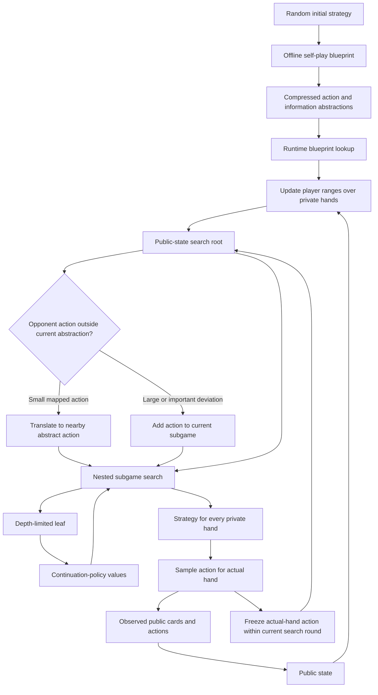

# Pluribus: Technical Description of the Multiplayer Poker Bot

## Document purpose

This document explains Pluribus, the six-player no-limit Texas hold'em poker bot, using the publicly available research paper, supplementary material, foundational algorithm papers, and public reference material.

The goal is requirements and architecture understanding. It describes what the published system did, which components were explicitly documented, and which low-level implementation details must be reconstructed from the published algorithms. It is not a source-code review, bug search, or claim that the original production source code is available.

The public description is sufficiently detailed to reproduce the main design principles and algorithmic pipeline, but it does not expose every production data structure, compiler option, optimization, or source-level class boundary. Where this document gives pseudocode or a likely data layout, it is labeled as a reconstruction rather than an exact listing of the original implementation.

## Primary references

The authoritative technical sources are:

1. Noam Brown and Tuomas Sandholm, “Superhuman AI for multiplayer poker,” *Science*, 2019. The main paper is available as the [public paper PDF](https://noambrown.github.io/papers/19-Science-Superhuman.pdf).
2. Brown and Sandholm, [supplementary materials for the Science paper](https://noambrown.github.io/papers/19-Science-Superhuman_Supp.pdf).
3. The published record for the article, [Science DOI 10.1126/science.aay2400](https://doi.org/10.1126/science.aay2400).
4. The public high-level summary, [Pluribus on Wikipedia](https://en.wikipedia.org/wiki/Pluribus_%28poker_bot%29).

Algorithm background is taken from:

5. Lanctot et al., “Monte Carlo Sampling for Regret Minimization in Extensive Games,” [NeurIPS 2009](https://papers.nips.cc/paper_files/paper/2009/hash/00411460f7c92d2124a67ea0f4cb5f85-Abstract.html).
6. Ganzfried and Sandholm, “Action Translation in Extensive-Form Games with Large Action Spaces,” [IJCAI 2013](https://www.ijcai.org/Proceedings/13/Papers/028.pdf), for pseudo-harmonic action translation.
7. Burch et al., “AIVAT: A New Variance Reduction Algorithm for Agent Evaluation,” [AAAI 2018](https://poker.cs.ualberta.ca/publications/aaai18-burch-aivat.pdf), for the evaluation methodology used in the Pluribus experiments.

## Executive summary

Pluribus is a two-stage imperfect-information game-playing system:

```text
Offline self-play blueprint
        |
        v
Compressed abstract strategy for the entire game
        |
        v
Runtime public-state belief update
        |
        v
Nested real-time subgame search from the current public state
        |
        v
Continuation-policy evaluation at search leaves
        |
        v
Action distribution for the bot's actual private cards
```

The most important architectural fact is that Pluribus does not attempt to solve the complete six-player no-limit hold'em game exactly during a hand. It first computes a coarse, full-game strategy called a blueprint. During play, it uses that blueprint as a prior and performs a fresh search in a smaller subgame rooted at the current public state.

The system combines the following mechanisms:

- Six-player no-limit Texas hold'em game logic.
- Self-play from random initialization, without human hand histories or a prior poker strategy.
- Counterfactual regret minimization, primarily external-sampling MCCFR for the offline blueprint.
- Linear CFR variants for both offline and online computation.
- Action abstraction, which restricts the set of bet sizes represented in the blueprint.
- Information abstraction, which groups strategically similar private-hand situations into buckets.
- Lossless treatment of the currently relevant betting round during live search, with lossy abstractions for future streets.
- Public-state search, where the search root represents a distribution over possible private-card histories consistent with the observed public state.
- Range or belief tracking for each player over the 1,326 possible two-card private holdings.
- An “unsafe” opponent model that uses Pluribus's own strategy as an approximation for actions already taken by opponents.
- Continuation policies that estimate the value of reaching a leaf without searching the rest of the game exactly.
- Off-tree action handling, including action translation for some small deviations and search expansion for larger deviations.
- Sampling at decision time so that the final strategy remains mixed and difficult to exploit.

Pluribus is therefore best understood as an abstracted tabular CFR solver with online nested search, not as a neural-network policy and not as a single precomputed lookup table.

## What problem Pluribus solved

### The game

The target game was six-player no-limit Texas hold'em. Each player receives two private cards. Five community cards are revealed over the flop, turn, and river. Betting occurs before the flop and on each of the three postflop streets. Players may fold, call, check when legal, or make a bet or raise subject to the no-limit rules.

The game is an extensive-form imperfect-information game:

- A **history** is a complete sequence of private cards, public cards, chance events, player actions, and betting states.
- A **public state** contains information visible to every remaining player, such as the board, pot, betting sequence, stack sizes, and folded players.
- An **information set** contains the histories that a player cannot distinguish using that player's private cards and observations.
- A **chance node** deals private cards or community cards.
- A **terminal node** is reached at showdown or when all but one player have folded.
- A **utility** is the chip outcome for a player, generally normalized as a loss or gain relative to the pot and stacks.

The number of legal betting sequences is extremely large because no-limit poker permits a large number of bet sizes. The game is also multi-player. In two-player zero-sum poker, convergence toward a Nash equilibrium gives a strong exploitability interpretation. In six-player poker, a single global Nash equilibrium is not a practical engineering target with the same guarantees. The Pluribus paper therefore framed success primarily as empirical performance against strong human professionals and strong artificial opponents.

### Why a full exact solution was not used

An exact six-player hold'em tree would need to represent:

1. Every possible private-card deal.
2. Every public-card runout.
3. Every legal bet and raise size.
4. Every ordering of player actions.
5. Every information set separately for every player.
6. A strategy and regret information for a very large number of decision points.

Even storing the tree is not enough. CFR-style algorithms repeatedly traverse large parts of that tree, so memory, traversal time, and the cost of sampling all become limiting factors.

Pluribus addresses this through two distinct reductions:

- **Abstraction** reduces the stored strategy's action and information dimensions.
- **Online search** spends more computation only in the current public subgame, where the decision is needed immediately.

The result is a system that stores a strategically useful approximation of the whole game, then locally refines it at runtime.

## High-level system architecture



The blueprint is computed offline. The public state, ranges, and nested search are maintained online. A new betting round normally creates a new search root because the public information and available future actions have changed.

## Core concepts

### Blueprint strategy

The blueprint is a strategy for the whole game under a reduced representation. It is not the final action for a particular hand. It gives Pluribus a baseline strategy for:

- Situations that have not yet been searched.
- Future streets below a live search leaf.
- Opponent actions that can be handled by translation rather than by a new search.
- Initial beliefs about how players act after observed decisions.

The blueprint is intentionally coarse compared with the local runtime search. It is designed to cover the whole game within a fixed offline budget.

### Range or belief distribution

At any public state, each player can hold one of 1,326 two-card combinations, before accounting for cards that are already known or unavailable. Pluribus maintains a probability distribution over the possible private holdings for each player.

The initial distribution is uniform over legal combinations. After an action is observed, the distribution is updated using Bayes' rule and the strategy that assigns probability to that action:

```text
new_probability(hand | observed_action)
    proportional to
        old_probability(hand)
        * strategy_probability(observed_action | hand)
```

The distribution is then renormalized over legal private-card combinations. In practice, public cards and known private cards remove impossible combinations before or during this update.

The distribution is not a declaration that the opponent is literally using the blueprint. It is a computational belief model. It converts observed actions into weighted possibilities about hidden cards.

### Public-state search root

The live search root is not one complete private-card history. It is a public state together with a distribution over possible private histories. The supplementary material describes the root as a probability distribution over all histories that are consistent with the public state, normalized by their reach probabilities.

This matters because the bot must select one action for its actual private cards while preserving a coherent strategy for all other holdings. Searching only the actual hand would make the bot's range unbalanced and could reveal information through its decisions.

### Information set and bucket

An information set describes a player's decision situation from that player's perspective. It includes the public state and the player's private cards, but not hidden cards held by opponents.

An information abstraction maps many strategically related information sets to one bucket. The bucket is an integer key used to share regret and strategy values. The mapping is lossy: different hands or board configurations can be grouped together when their future strategic behavior is considered similar enough for the abstraction.

Pluribus uses different abstraction resolutions in different phases:

- The offline blueprint uses a relatively small number of buckets on later streets.
- Live search represents the current betting round losslessly where practical.
- Future streets below the current search horizon use a larger but still lossy bucket set.

### Counterfactual regret minimization

CFR learns a strategy by repeatedly comparing the value of actions with the value of the current strategy at each information set. The difference is accumulated as regret. Positive cumulative regret is converted into the next strategy using regret matching.

For an information set `I` and action `a`, the basic regret-matching form is:

```text
R_plus(I, a) = max(R(I, a), 0)

if sum_a R_plus(I, a) > 0:
    sigma(I, a) = R_plus(I, a) / sum_a R_plus(I, a)
else:
    sigma(I, a) = 1 / number_of_legal_actions
```

The practical Pluribus implementation uses sampling and linear weighting to reduce computation and prioritize more recent iterations.

## Offline blueprint construction

### Initialization and self-play

Pluribus was trained from scratch through self-play. The public description says that it did not use human hand histories, expert rules, or a strategy copied from an earlier poker bot. The agents repeatedly played the abstracted game against copies of themselves and updated their regrets and strategy statistics.

The practical meaning of “from scratch” is that the learning process began without a pre-existing poker policy. The game rules, abstraction, terminal utility calculation, chance sampling, and CFR machinery were supplied by the implementation. The strategic preferences were generated by iterative self-play.

Self-play is important in multiplayer poker because there may be no single opponent model that represents the target population. The blueprint learns a policy that is internally consistent against copies of itself, then live search adapts that policy to the current public situation.

### Blueprint game abstraction

The blueprint does not store every legal no-limit action. The action abstraction represents a limited menu of bet and raise sizes. The published paper describes roughly one to fourteen available actions at a decision point, with action menus selected using pot-relative sizes and game-specific rules. Fold and call are represented where legal, and check is represented when available.

This action reduction has two effects:

1. It reduces the branching factor of every CFR traversal.
2. It reduces the number of action-regret entries stored at each information set.

The abstraction is not a fixed poker convention such as “always use one-third pot and two-thirds pot.” It is part of the solver configuration and can vary by street, stack-to-pot situation, player count, and betting context. The published implementation used a richer action menu in some early decisions and a smaller menu in later decisions.

An important consequence is that a real opponent can choose an action that is not represented in the blueprint. Pluribus therefore needs an explicit off-tree action policy. It does not simply reject the action or force the opponent to choose the nearest stored action.

### Information abstraction in the blueprint

The paper describes information abstraction as grouping similar private-card and public-board situations. The supplementary material gives more specific implementation detail:

- After the first betting round, the blueprint uses approximately 200 information buckets per round.
- The buckets are generated using k-means clustering.
- The feature set is domain-specific rather than a generic neural embedding.
- The features include poker-relevant hand and board characteristics intended to correlate with future value and strategic behavior.

The first betting round is treated more precisely than later rounds because it is a major root decision and because a small error at the start of a hand affects the entire continuation. Later rounds have fewer cards to come but still contain a large number of possible private-card and board configurations, so they receive a compressed representation.

### External-sampling MCCFR

The offline blueprint uses external-sampling Monte Carlo CFR. The central sampling choice is:

- Sample chance events and the actions of non-traversing players.
- At the traversing player's information set, evaluate all available actions so that regrets can be updated for each action.

This produces an unbiased or appropriately weighted estimate of the counterfactual values while traversing far fewer branches than a full-tree CFR iteration.

For one sampled traversal, the conceptual flow is:

```text
1. Select a traversing player.
2. Sample a legal chance outcome when the node is a chance node.
3. If the node belongs to another player, sample one action from that player's strategy.
4. If the node belongs to the traversing player, recursively evaluate all current actions.
5. Compute the strategy value and each action value.
6. Add action value minus strategy value to the traverser's cumulative regret.
7. Add the reached strategy contribution to average-strategy statistics.
```

The sample is not a single deterministic line through all player choices. The traverser branches over its own actions while chance and opponents are sampled. That is the defining computational tradeoff of external-sampling MCCFR.

A simplified conceptual traversal is:

```text
function traverse(history, traverser):
    if terminal(history):
        return utility(history, traverser)

    if chance(history):
        outcome = sample_chance(history)
        return traverse(history + outcome, traverser)

    player = acting_player(history)
    infoset = information_set(player, history)
    strategy = regret_match(infoset)

    if player != traverser:
        action = sample(strategy)
        return traverse(history + action, traverser)

    strategy_value = 0
    for action in legal_actions(history):
        action_value[action] = traverse(history + action, traverser)
        strategy_value += strategy[action] * action_value[action]

    for action in legal_actions(history):
        regret[infoset, action] += action_value[action] - strategy_value

    average_strategy[infoset] += reach_weight * strategy
    return strategy_value
```

The actual implementation must account for reach probabilities, chance probabilities, player utility conventions, abstraction keys, sampled histories, and the multi-player version of counterfactual value. The pseudocode shows the algorithmic shape, not the exact estimator or production source.

### Linear weighting

The blueprint uses Linear CFR-style weighting. Later iterations receive more weight when constructing the average strategy. This is useful because early iterations are often unstable and the later strategy is usually a better estimate of the converged behavior.

The supplementary material describes a periodic weighting schedule applied during the long blueprint run. It also distinguishes between the current strategy used for regret matching and the weighted strategy accumulated for play. The exact schedule is an implementation detail of the published system, but the requirements are:

- Regret updates must be accumulated over sampled traversals.
- Strategy averaging must apply increasing weight to later iterations.
- The final blueprint used for many decisions is an average strategy, not simply the last sampled policy.

### Regret pruning

After a long initial period, the implementation pruned traversals whose regret for an action had become sufficiently negative. The supplementary material describes a threshold around negative 300 million in the stored regret representation. It also describes keeping a small fraction of full traversals so the system could continue to revisit actions rather than permanently deleting them.

The reason for pruning is computational, not strategic certainty. An action with strongly negative cumulative regret is unlikely to be selected by regret matching, so repeatedly traversing that branch has low value during the current phase. Skipping it makes the effective abstraction more useful within the same time budget.

The published implementation stored blueprint regrets using four-byte integer values. A floor was used to prevent overflow or unlimited negative accumulation. This is a memory optimization that relies on the fact that the strategy primarily needs the relative ordering and positive mass of regrets, not arbitrary precision for every historical update.

### Strategy snapshotting and memory reduction

The supplementary material describes a strategy snapshot technique for the long blueprint computation:

- The first betting round's average strategy is stored after an initial training period.
- Later rounds periodically save current strategy snapshots.
- The final strategy for those rounds is formed from the average of snapshots rather than retaining every raw per-iteration strategy table.

This reduces memory and lowers some of the repeated averaging work. It also reflects an engineering reality: storing the entire cumulative strategy history is unnecessary when only a compact estimate of the average strategy is needed.

### Lazy allocation and sparse storage

The full abstracted strategy space is still large. The paper reports that many possible abstract information sets were never reached during blueprint computation. Strategy and regret data were therefore allocated lazily for encountered information sets instead of materializing every theoretical combination.

The main storage key conceptually contains:

```text
public betting state
private-hand bucket
player identity or acting-player context
abstract action index
```

The production implementation may encode this as packed integers, arrays behind node indices, or another compact layout. The published numbers establish the requirement: storage must be sparse enough that unreachable parts of the abstract tree do not consume full strategy rows.

### Blueprint resource requirements

The main paper reports that the blueprint was computed in about eight days using a 64-core server, with roughly 12,400 CPU core-hours and less than 512 GB of memory. The supplementary material identifies a shared-memory machine with four 16-core Intel Xeon E5-8860 v3 processors and less than 0.5 TB of memory.

The public implementation was CPU-based. The supplementary material states that no GPUs were used for the blueprint or live search. This is significant because the algorithm's dominant workload is irregular tree traversal, sparse information-set access, sampling, and updates rather than a dense neural-network inference pass.

## Abstraction design in detail

### Why action abstraction is necessary

No-limit betting gives a player many legal bet sizes. If every possible integer chip amount were a separate action, the action branching factor would be too high for repeated regret updates.

The blueprint therefore chooses a finite menu. For an abstracted decision, the bot's strategy contains probabilities only for those abstract actions. The chosen menu is usually described with pot-relative bet sizes, but the real legality rules still depend on:

- Current pot.
- Effective stack.
- Minimum raise size.
- Previous raise size.
- Number of players remaining.
- Street and betting history.

The abstract action generator must turn a nominal size into a legal action for the exact state. A nominal “half pot” action cannot be applied blindly when a player is all in, when the minimum raise is larger, or when the effective stack caps the action.

### Off-tree opponent actions

An opponent may bet a size that is absent from the current abstract action menu. Pluribus uses several handling modes, chosen by the situation.

For relatively small deviations in the first betting round, the action can be mapped to a nearby abstract action using a pseudo-harmonic translation rule. The purpose is to preserve a meaningful relationship between the original bet and the stored strategic response without adding every possible bet size to the blueprint.

For more important off-tree deviations, the live search expands the current subgame to include the observed action. The search then solves from the beginning of the current betting round with the new action available. The main paper describes large first-round deviations above approximately 100 dollars and situations with no more than four players as cases that can trigger a direct first-round search. The exact threshold is part of the published implementation configuration, not a universal poker rule.

After a translated or expanded action is processed, the observed action becomes part of the current public state and range updates continue from there.

### Pseudo-harmonic translation

Pseudo-harmonic action translation is a published approach for mapping an action that is not in a stored abstraction to an available nearby action. The mapping is designed to preserve the strategic scale of actions and avoid the distortions that can result from simply choosing the closest value in absolute chips.

In Pluribus, this is used as a bridge between a continuous or very large action space and a finite blueprint. A translation can be thought of as:

```text
observed bet size
    -> normalized action scale
    -> pseudo-harmonic abstract action mapping
    -> translated action used for blueprint lookup
```

This is not the same as pretending the opponent chose the abstract action. It is an approximation that lets the system use a precomputed strategy when a full live re-search is not warranted.

### Information abstraction features

The published materials do not provide a complete source-level list of every feature and clustering parameter. They do establish the following design:

- Buckets are intended to group hands with similar strategic consequences.
- The clustering is domain-specific.
- K-means is used for the blueprint bucket construction.
- Later-street bucket features include future hand potential, not only current showdown strength.

A hand-strength-only abstraction would be insufficient. Two hands with similar current strength can differ greatly in their ability to improve, block opponent holdings, make strong draws, or become vulnerable on later cards. The abstraction therefore needs features that capture the distribution of future outcomes and strategic potential.

### Current-round lossless search abstraction

The online search uses a different allocation of precision. The current betting round is represented without the same coarse information bucket compression used by the blueprint. Future rounds are grouped into approximately 500 buckets per flop, using a potential-aware clustering method involving Earth Mover's Distance.

This division matches the runtime objective:

- The action selected now must respond accurately to the current private cards and current public state.
- The full future game is too large to solve exactly inside the decision time.
- A richer future abstraction improves leaf estimates without requiring the complete future tree.

The result is a rolling precision window. The street on which the decision is being made receives the most detail, and later streets are represented by compressed continuation states.

## Runtime nested subgame search

### Why search is performed during play

The blueprint must cover every possible public state and can only afford a coarse abstraction. A live search can use the exact current public state, the actual observed action sequence, and the current ranges. It can therefore correct some blueprint errors that matter for the hand currently being played.

Runtime search also handles actions that were not represented in the offline abstraction. Instead of requiring the opponent to stay inside the blueprint's action menu, Pluribus can add the observed action to the current subgame and solve a local response.

The cost is decision latency. The published system searched for roughly 1 to 33 seconds per decision, with a typical hand decision taking around 20 seconds on a 28-core, 128 GB CPU machine.

### Search root construction

The online search begins at the start of the current betting round. The root contains:

- The public board and betting sequence.
- The players still active in the hand.
- Pot and stack information.
- The set of legal actions, including any newly added off-tree action.
- A belief distribution over possible private hands for each player.
- A strategy prior from the blueprint or a previous search.

The search root represents all possible private histories consistent with the public state. It does not assume that the bot's actual private cards are the only state that matters.

### Range tracking over 1,326 combinations

There are `C(52, 2) = 1,326` possible two-card combinations before known-card filtering. A runtime range can be represented as a fixed-size array indexed by a canonical two-card combination ID:

```text
range[player][private_hand_id] -> probability or reach weight
```

The legal set is reduced by the public board and by any known private cards. A practical implementation can use dense fixed-size arrays for the 1,326 combinations because this dimension is bounded and small compared with the complete game tree. The larger tree state remains sparse and abstracted.

When an opponent action is observed, the range is weighted by the probability that the strategy would have chosen that action with each private hand. The range is then normalized. If a strategy assigns near-zero probability to the observed action for a hand, that hand's posterior weight becomes small.

The published description distinguishes the source of the strategy used in this update:

- Use the blueprint if the situation has not been searched.
- Use the previous search strategy if an earlier nested search produced the relevant action probabilities.

### Unsafe search

Pluribus uses an unsafe opponent model in live search. When an opponent has already acted, the search assumes that the opponent's action probabilities are represented by Pluribus's own strategy or by the strategy available from the current search context.

This is called unsafe because it does not provide the strongest theoretical guarantee against an arbitrary opponent model. It is computationally attractive because the system does not need to infer a complete unknown opponent policy from a small number of observed actions.

The published motivation is practical. In a multiplayer game, exact reasoning over every possible opponent strategy is infeasible. Using the bot's own strategy as a proxy produces a consistent model that can be searched quickly. The paper reports that unsafe search is approximately four times faster than a safer alternative in the relevant comparison.

Unsafe search should not be confused with opponent-specific learning. Pluribus was designed to use a general strategy and current public information, not to build a long-term player identity model or exploit a named opponent through a persistent database.

### Nested search boundary

The search is “nested” because a search is performed at the current public state, and a new search can be started at the next betting round. The current subgame generally begins at the start of the current round rather than at the beginning of the hand.

The supplementary material describes the following broad leaf placement rules:

- A first-round search continues to the start of the next betting round.
- In some multi-player second-round cases, the leaf is placed at the start of the third round or after a second raise, whichever comes first.
- Other smaller subgames can be searched further toward terminal outcomes.

These rules allocate computation according to branching factor. Early rounds and multi-player states are wide, so search stops sooner and delegates the remainder to continuation policies. Smaller or later subgames can be searched deeper.

### Search algorithm choices

The implementation uses different Linear CFR search variants according to subgame size:

- Large or early subgames use Monte Carlo Linear CFR.
- Smaller subgames use a vector-based Linear CFR method.
- In the vector-based method, chance sampling is reduced by using one public board sample per thread in the relevant computation.

The exact engineering choice is a throughput tradeoff. Monte Carlo sampling reduces traversal work when the subgame is large. Vectorized or batched calculations are more attractive when the subgame is small enough to keep more values in arrays and process them together.

The supplementary material states that the final iteration strategy is used for action selection, while the weighted-average strategy is used for updates. This is a common distinction in CFR implementations: the average strategy is usually the object associated with convergence, but the current strategy can be useful for the immediate local decision.

## Nested search algorithm reconstructed

The following is a readable reconstruction of the control flow described in the supplementary material. It is not the original source code.

```text
function play_hand():
    state = deal_and_initialize_public_state()
    initialize_uniform_or_legal_ranges(state)
    blueprint = load_blueprint()

    while not terminal(state):
        if start_of_betting_round(state):
            root = make_public_root(state, ranges, blueprint)
            strategy = nested_search(root)

        if opponent_action_is_observed(state):
            if action_is_inside_blueprint(state):
                process_action_using_blueprint_or_current_search()
            else if action_is_small_and_translatable(state):
                translated = pseudo_harmonic_translate(state.action)
                process_translated_action(translated)
            else:
                add_action_to_current_subgame(state.action)
                strategy = nested_search(root_from_start_of_current_round)

            update_ranges_with_observed_action()
            advance_public_state()

        if acting_player_is_pluribus(state):
            strategy_for_all_hands = get_current_strategy(strategy, state)
            actual_hand_strategy = strategy_for_all_hands[pluribus_private_cards]
            action = sample(actual_hand_strategy)

            freeze_action_probability_for_actual_hand_until_round_end(
                actual_hand_strategy
            )
            apply_action(state, action)

    return terminal_utility_or_fold_result(state)
```

The important detail is that the bot searches a strategy for the full range, then selects from the row for its actual private hand. The search is not rerun from scratch after every own action within the same betting round. Instead, the chosen action probabilities for the actual hand are frozen for the current round, and the search is re-rooted at the next round or after a qualifying opponent deviation.

## Handling the bot's own action within a search round

When Pluribus takes an action, the strategy must remain coherent over all private hands, but the actual hand has now revealed no new public information to opponents other than the action itself. The supplementary material describes freezing the action probabilities for the traverser's actual hand after that choice within the current betting round.

This has two purposes:

1. It prevents the bot from repeatedly changing the already selected action distribution for the same private hand as the local public node advances.
2. It avoids recomputing a complete nested search after every own decision in a way that would be too expensive.

The freeze applies to the bot's actual hand strategy. It does not freeze every possible private hand in the range. Other hypothetical hands still need their strategy probabilities for range reasoning and for evaluating the opponent's beliefs.

Opponent probabilities are not frozen in the same way. They are updated as actions are observed and as the search model evaluates possible continuation choices.

At the next betting round, the search root is reset using the new public state and updated ranges.

## Continuation policies at search leaves

### Why continuation policies are needed

A depth-limited search reaches a nonterminal leaf before the hand is finished. The solver needs a value estimate for what happens after that point.

Using a single static blueprint continuation can make the search overfit to one assumed future behavior and can create tactical weaknesses. Pluribus instead uses a small set of continuation policies and allows a player to choose among them in the abstract continuation state.

### The four published continuation choices

The supplementary material describes four continuation policies:

1. The normal blueprint strategy.
2. A folding-biased strategy that multiplies fold probabilities by five and renormalizes.
3. A calling-biased strategy that multiplies call probabilities by five and renormalizes.
4. A raising-biased strategy that multiplies raise probabilities by five and renormalizes.

The multiplier is applied to the relevant action class, after which the row is normalized so it remains a probability distribution. The exact implementation must account for the legal action menu at the continuation information set. For example, a state with no legal raise cannot receive a raise boost.

The four options create a compact model of strategically different futures:

```text
normal      -> baseline continuation
fold-heavy  -> more immediate folds
call-heavy  -> more calls and fewer aggressive branches proportionally
raise-heavy -> more raises and aggressive branches proportionally
```

The continuation choice is itself part of the strategic problem. A player may choose a mixture of these policies, but that choice must be consistent across information sets that are indistinguishable to that player. Otherwise the model could use hidden information to select a continuation policy and become unrealistically strong.

### Leaf value computation

At a search leaf, the solver uses the current ranges, the public state, and one of the continuation policies to estimate the expected terminal utility. A conceptual form is:

```text
leaf_value(public_state, ranges, continuation_policy)
    = expected utility after continuing from the leaf
      under the selected policy for every player
```

The actual implementation can evaluate this with further sampling, abstract continuation traversals, or cached terminal and showdown calculations. The public materials establish the policy set and its role, but do not publish every low-level terminal-value cache or memory layout.

### Compression of continuation policies

Storing four complete continuation policy rows for every abstract information set would multiply memory. The supplementary material describes compressing the policies by sampling one continuation action per abstract information set. This stores a compact sampled representation while preserving different continuation behavior across the four policy classes.

For a leaf that is not exactly represented in the blueprint, the implementation finds a nearby blueprint node through a deterministic translation method, including pseudo-harmonic translation where applicable. The continuation policies are then applied to that nearby abstract state.

## Search and action-selection pseudocode

The following pseudocode combines the published pieces into one conceptual solver. It is intended as a requirements-level model for a future implementation.

```text
function nested_search(root):
    initialize_local_regrets(root)
    initialize_local_strategy_sums(root)

    for iteration in 1 .. search_budget:
        traverser = select_traverser()
        traverse_search_state(root, traverser)

    return current_strategy_or_average_strategy(root)


function traverse_search_state(node, traverser):
    if node is terminal:
        return terminal_utility(node, traverser)

    if node is a depth-limited leaf:
        return continuation_value(node, traverser)

    if node is chance:
        outcome = sample_or_vectorize_chance(node)
        return traverse_search_state(node + outcome, traverser)

    player = node.acting_player
    infoset = make_search_infoset(node, player)
    sigma = regret_match(infoset)

    if player != traverser:
        action = sample_or_vectorize(sigma)
        return traverse_search_state(node + action, traverser)

    for action in node.legal_actions:
        value[action] = traverse_search_state(node + action, traverser)

    node_value = weighted_sum(sigma, value)
    for action in node.legal_actions:
        regret[infoset, action] += value[action] - node_value

    strategy_sum[infoset] += reach_weight * sigma
    return node_value


function continuation_value(leaf, traverser):
    total = 0
    for policy_choice in [blueprint, fold_heavy, call_heavy, raise_heavy]:
        total += solve_or_sample_continuation(leaf, policy_choice, traverser)
    return strategy_weighted_combination(total)
```

## Detailed runtime state

A practical implementation needs more than a strategy table. The following state categories are required by the published design.

### Public game state

The public state must identify:

- Street: preflop, flop, turn, or river.
- Public board cards.
- Pot size and side-pot information if applicable.
- Effective stack sizes and remaining stacks.
- Players still active and players who folded.
- Acting player.
- Current bet and minimum legal raise.
- Complete public betting sequence for the current hand.
- Start-of-round boundary used for nested search.
- Current abstract and concrete action menus.

The betting sequence is needed because no-limit legality and strategy depend on prior raises, not only on the current pot.

### Private-hand representation

Private hands should have a canonical combination ID for the 1,326 possible card pairs. A runtime range can then use a fixed-size array or a compact legal-combination list. The evaluator also needs a fast way to detect card conflicts with the public board and with sampled opponent holdings.

### Range state

For every active player, the runtime needs:

- Reach probability or posterior weight for each legal private-hand combination.
- The strategy source used for the latest update.
- Any normalization or card-removal mask.
- The action observation that caused the latest update, if diagnostics are retained.

The production bot was optimized for throughput and memory, so a diagnostic-rich object graph is not implied by the paper. A compact numeric representation is the natural implementation choice.

### Abstract information-set key

The blueprint and search tables need a stable key derived from a state. A conceptual key can include:

```text
street
public board representation or board class
betting sequence ID
player-to-act ID
private-hand bucket or exact private-hand ID
number of active players
stack and pot class
```

The exact key is likely packed or indexed through precomputed node IDs. The key must not use long strings in hot traversal loops if the goal is the same performance profile as the published system.

### Regret and strategy rows

Each information set has an action row:

```text
action_index -> cumulative regret
action_index -> accumulated strategy weight
```

For the offline blueprint, regret values were stored compactly, including four-byte integer storage described in the supplement. Live search needs mutable local tables for the current subgame, not necessarily the entire blueprint's regret store.

### Continuation-policy storage

Continuation policy support requires either:

- Four strategy transformations that can be applied to a normal row at evaluation time.
- Four compact policy rows.
- Sampled action choices or another compressed representation for each abstract continuation state.

The published implementation used compression by sampling actions per abstract information set. A reproduction should preserve the semantics of the four policy classes even if its internal storage differs.

## Publicly documented implementation details

The following details are directly supported by the published technical materials:

| Area | Published behavior |
|---|---|
| Game | Six-player no-limit Texas hold'em |
| Training | Self-play from scratch; no human data or prior poker strategy used |
| Offline algorithm | External-sampling MCCFR with Linear CFR techniques |
| Offline action abstraction | A small finite action menu, described as roughly 1 to 14 actions in relevant states |
| Offline information abstraction | Approximately 200 buckets after the first round, using domain-specific features and k-means |
| Blueprint compute | About eight days, approximately 12,400 CPU core-hours, under 512 GB |
| Blueprint machine | Shared-memory CPU server; supplementary material identifies four 16-core Xeon E5-8860 v3 processors |
| GPU use | No GPUs used for blueprint or live search |
| Online search | Nested search from the current public state and betting-round boundary |
| Search abstraction | Current round lossless where practical; approximately 500 future buckets per flop using potential-aware clustering and Earth Mover's Distance |
| Online search algorithms | Monte Carlo Linear CFR for large/early subgames and vector-based Linear CFR for smaller subgames |
| Range model | Distribution over private-card combinations, updated with Bayes' rule after observed actions |
| Opponent model | Unsafe search using the bot's own strategy as an opponent-policy approximation |
| Leaf values | Four continuation policies: blueprint, fold-heavy, call-heavy, raise-heavy |
| Off-tree actions | Translation for some deviations; current-subgame expansion and search for larger or important deviations |
| Live hardware | 28-core CPU node with 128 GB memory, identified as two 14-core Haswell E5-2695 v3 CPUs |
| Live latency | Approximately 1 to 33 seconds per search, with about 20 seconds per hand decision in the reported setup |
| Evaluation | AIVAT variance reduction used in human and bot match experiments |

Details outside this table should be treated as either an explanation of these published behaviors or an implementation reconstruction.

## What the offline and online strategies each do

The two strategy layers have different responsibilities.

| Requirement | Offline blueprint | Online nested search |
|---|---|---|
| Coverage | Entire abstracted game | Current public subgame |
| Available time | Days | Seconds per decision |
| Information precision | Coarse later-street buckets | Current-round lossless, future-round buckets |
| Action set | Preselected abstract menu | Can add observed off-tree actions locally |
| Opponent uncertainty | Self-play strategy distribution | Range update plus unsafe search model |
| Future evaluation | Stored blueprint | Local search plus continuation policies |
| Memory scope | Large shared blueprint | Current subgame and working buffers |
| Main purpose | Provide a stable strategic prior | Adapt and refine the current decision |

The blueprint is not discarded when search starts. It supplies prior probabilities, future continuation behavior, and a fallback for situations the live search does not represent exactly.

## Why the strategy remains mixed

Poker strategies must often randomize equivalent-looking hands. If a bot always folds a particular weak hand, always raises a particular bluff, or always uses one bet size with one hand class, an opponent can infer information from observed actions.

Pluribus therefore computes action probabilities for a range of private hands and samples an action from the probability row for the actual holding. This gives the bot a mixed strategy. The randomization is not an artificial personality layer. It is the direct output of regret matching, averaging, abstraction, and runtime search.

The correct runtime sequence is conceptually:

```text
search public state
    -> obtain action probabilities for each relevant private hand
    -> select the row for Pluribus's actual two cards
    -> sample one legal action
    -> expose only the chosen action to opponents
```

The probability row is calculated before the sample. Sampling the final action instead of choosing the maximum-probability action is necessary to preserve the intended mixture.

## How Pluribus handles different phases of a hand

### Before the flop

The first betting round has a large strategic impact and a high branching factor. The blueprint uses an abstract action menu and a more precise representation than later streets. If a relevant opponent action is outside the menu, Pluribus may either translate it or run a first-round search, depending on the deviation and public state.

The main paper reports special handling for first-round off-tree actions, including a threshold around a 100-dollar raise and a player-count condition. This reflects a resource policy: search important deviations when the subgame remains manageable, and translate less consequential deviations when a full re-search would be too expensive.

### Flop and turn

The current betting round is searched with more detail. The public board is known, ranges have been updated from earlier actions, and the local search can reason about the observed action sequence. Future streets are still represented by compressed buckets and continuation policies.

Multi-player flop states can be extremely wide. The supplementary material therefore uses shallower search boundaries in some multi-player second-round states, delegating more of the later game to continuation estimates.

### River

There are no future board cards after the river, so the continuation problem is smaller in one sense, but betting can still have a large action tree. Smaller river subgames can be searched more deeply, and terminal showdown utilities can be evaluated directly when all action is complete.

### Transition to a new street

When a new public card is dealt, the public state changes and the current-round search boundary is reached. Pluribus updates the ranges with the action history, makes the new board part of the public root, and starts a new nested search for the new street.

## Terminal utility and showdown reasoning

At a terminal node, utility is determined by the poker rules:

- If all but one player fold, the remaining player receives the pot according to the rules.
- If multiple players reach showdown, private hands are compared against the public board.
- Side pots and stack constraints must be reflected if the game configuration permits them.
- Utilities are expressed from each player's perspective or using a consistent zero-sum-compatible accounting convention for the particular pot.

The paper focuses on the search and learning system rather than publishing a complete hand evaluator implementation. A reproduction still requires a correct evaluator and exact card-removal logic because range values, terminal utilities, and board features all depend on it.

For a multi-player system, a terminal evaluator must return utility for the traversing player or all players as required by the chosen CFR estimator. It cannot assume a two-player utility shortcut without changing the game model.

## Multi-player CFR considerations

Pluribus applies CFR-style regret minimization in a game with more than two players. The algorithm still maintains local action regrets and uses sampled counterfactual traversals, but the theoretical interpretation differs from two-player zero-sum CFR.

Important consequences:

- Convergence of each local regret table does not automatically imply a practical global Nash equilibrium for the six-player game.
- The value of an action depends on several other players and on their reach probabilities.
- Range tracking must be maintained for all active players, not only one opponent.
- A local search may choose a continuation policy for each player, subject to information-set consistency.
- Evaluation against actual opponents is an empirical requirement, not just a theoretical residual-exploitability measurement.

This is why the paper emphasizes superhuman performance in controlled human and bot matches rather than claiming that the entire multiplayer game was solved exactly.

## Performance and memory engineering

### Offline computation

The offline blueprint was large enough to require a dedicated shared-memory CPU server and multiple days of computation. The main paper reports about eight days and 12,400 CPU core-hours. The supplementary hardware description identifies four 16-core CPUs, which provides 64 physical cores.

The main performance levers are:

- Sampling chance and opponent actions.
- Restricting action menus.
- Bucketing similar information sets.
- Allocating rows lazily only when reached.
- Pruning actions with strongly negative regrets after an initial period.
- Using compact regret values.
- Sharing or snapshotting strategy data rather than retaining every raw iteration.

### Runtime computation

The live bot had to produce a decision in seconds rather than days. The reported runtime system used a 28-core CPU node with 128 GB memory. Search durations ranged from approximately 1 to 33 seconds, with an average around 20 seconds per decision in the reported configuration.

The runtime must keep the complete blueprint accessible while allocating enough temporary storage for the current subgame. It cannot materialize the complete exact future game for every decision. A practical implementation therefore needs:

- Compact immutable or mostly read-only blueprint tables.
- A local mutable table for current search regrets and strategy sums.
- Reusable traversal buffers.
- Efficient range arrays.
- Compact board and action IDs.
- A memory-aware policy for subgame expansion when an opponent action is off-tree.

### CPU rather than GPU

No GPU was used. The workload contains irregular control flow, variable-length betting sequences, sparse information-set access, and extensive pointer or index traversal. Those properties are less naturally mapped to dense GPU kernels than a regular neural-network inference workload.

This does not mean the algorithm cannot be optimized with vector instructions. It means the published system's primary implementation path was CPU-based and relied on sampling, compact storage, and parallel traversals.

## Parallelism model

The public materials identify multi-core CPU execution and thread-level sampling, but do not publish every synchronization primitive or scheduler detail. A faithful requirements-level parallel design is:

1. Run independent sampled traversals or trajectory batches on worker threads.
2. Keep local updates in worker-local buffers where possible.
3. Merge updates into shared rows using a controlled policy.
4. Avoid allowing nondeterministic update order to dominate numerical behavior if reproducibility is required.

The vector-based live method uses one public board sample per thread in the described computation. This indicates that the implementation used parallel sampling units and kept enough local state to process a board sample efficiently.

The exact production synchronization strategy is not publicly specified. It is therefore unsafe to claim that Pluribus used a particular lock-free table, atomic floating-point update scheme, or deterministic merge order without source evidence.

## Evaluation methodology

### Match configurations

The paper evaluated Pluribus in multiplayer matches with professional poker players and artificial opponents. The reported experiments included configurations with five humans and Pluribus, and configurations with one human and five Pluribus agents. Each configuration used 10,000 hands in the reported tests.

The main reported results were approximately:

- 48 milli-big-blinds per game in the five-human configuration.
- 32 milli-big-blinds per game in the one-human and five-bot configuration.

The paper reports statistical significance for the match-level results. The exact interpretation depends on the match design and variance-reduction procedure, so the figures should be read as experimental outcomes under the published setup, not as a universal win rate in every poker environment.

### AIVAT variance reduction

Poker results have very high variance. A bot can win or lose many hands because of card luck even when its strategic decisions are strong. Pluribus evaluation used AIVAT, an unbiased variance-reduction estimator designed for agent evaluation in imperfect-information games.

AIVAT uses known strategy and value information to subtract predictable variance while preserving an unbiased estimate of the performance difference. It is an evaluation tool. It is not part of Pluribus's runtime strategy computation and does not teach the bot how to play.

The distinction is important:

```text
Pluribus playing system -> blueprint, ranges, nested search, continuation policies
Evaluation system        -> match protocol, hand logging, AIVAT analysis
```

### What the evaluation does and does not prove

The published matches demonstrate that the system was very strong against the selected professionals and bot configurations. They do not prove that the system is an exact Nash equilibrium for six-player no-limit hold'em, nor that it would be optimal against every future strategy or ruleset.

The system's strength comes from the interaction of approximation layers that performed well together:

- Broad self-play coverage.
- Local runtime refinement.
- Range-aware reasoning.
- Randomized action selection.
- Off-tree action handling.
- Multi-player-aware search and continuation modeling.

## What Pluribus is not

### Not a neural-network poker bot

The published architecture is based on tabular or indexed strategy values, abstraction, CFR, and online search. It is not described as a deep neural network that receives cards and outputs logits. The system can use clustering and compact numeric representations without being a neural policy.

### Not pure precomputed lookup

The blueprint is precomputed, but Pluribus also searches during the hand. A pure lookup bot would not expand an off-tree action, update current ranges, or solve a fresh public subgame.

### Not a complete exact solver

The game remains abstracted and depth-limited in the practical system. Continuation policies approximate parts of the future. The method is an engineering solution for bounded time and memory, not a complete exact representation of every no-limit action and private-card history.

### Not a guaranteed multiplayer Nash solver

The paper does not claim a strong global Nash guarantee for the full six-player game. The goal is practical performance in a multiplayer environment where exact equilibrium guarantees are much weaker or less directly useful than in two-player zero-sum games.

### Not a persistent opponent database

The public technical description does not make Pluribus dependent on recognizing individual opponents or retaining long-term player profiles. Its runtime adaptation is primarily to the current hand, current public state, observed actions, and range beliefs.

### Not publicly released production source code

Public reporting states that the authors did not release the source code because of concerns that a poker bot implementation could enable cheating. The algorithms and important implementation details were published, but the exact production repository, class names, and all low-level optimizations are not public.

## Reproduction requirements

A new implementation that aims to reproduce the published design needs the following subsystems.

### Game engine

The engine must implement:

- Six-player no-limit hold'em rules.
- Complete action legality.
- Pot, stack, raise, and all-in accounting.
- Chance dealing without card duplication.
- Fold and showdown terminal conditions.
- Multi-player utility calculation.
- A canonical public betting-state representation.

### Hand evaluator and board features

The solver needs:

- Fast hand strength and showdown evaluation.
- Draw and future-potential features.
- Card-removal and blocker handling.
- Board texture representation for bucket clustering.
- Efficient enumeration or sampling of legal private-hand combinations.

### Abstract game builder

The abstraction layer needs to generate:

- Legal abstract action menus by state.
- Exact-to-bucket information mappings for blueprint states.
- More precise current-round keys for live search.
- Future-street bucket keys.
- Translation from concrete off-tree actions to abstract actions.
- Stable integer IDs for public nodes, actions, boards, and hand buckets.

### Offline CFR engine

The blueprint learner needs:

- External-sampling MCCFR traversal.
- Multi-player traverser selection and utility accounting.
- Regret-matching strategy construction.
- Linear strategy averaging.
- Chance and opponent sampling.
- Lazy row allocation.
- Regret pruning.
- Compact regret and strategy storage.
- Periodic checkpoints or snapshots.
- Parallel traversal support.

### Online nested-search engine

The runtime solver needs:

- Public-state root construction.
- Range initialization and Bayes updates.
- Search-local regret and strategy storage.
- Current-round lossless representation.
- Future-round bucket representation.
- Unsafe opponent modeling.
- Dynamic addition of off-tree actions.
- Search depth and resource limits.
- Current-hand strategy freezing within a round.
- Final action sampling.

### Continuation evaluator

The leaf evaluator needs:

- Normal blueprint continuation.
- Fold-heavy, call-heavy, and raise-heavy transformations.
- Information-set-consistent continuation selection.
- Sampled or compressed continuation representation.
- Terminal utility and showdown evaluation.
- Translation for abstract leaf states that do not have an exact blueprint entry.

### Runtime control and safety

The production system also needs operational controls:

- Fixed decision-time budget.
- Memory preflight for subgame expansion.
- Cancellation or fallback to the blueprint if search time expires.
- Reusable buffers to avoid per-traversal allocation.
- Logging that does not dominate hot traversal paths.
- Deterministic seeds or reproducible sampling when experiments require it.

The paper does not expose every one of these controls, but they follow directly from the reported hardware and latency constraints.

## Reconstructed end-to-end implementation flow

The following sequence explains how a complete implementation would behave without implying that the original source used these exact function names.

### Offline phase

```text
1. Define six-player no-limit hold'em rules.
2. Define legal concrete actions and terminal utilities.
3. Define the finite blueprint action abstraction.
4. Generate domain-specific hand and board features.
5. Cluster later-street information states into blueprint buckets.
6. Initialize strategy and regret rows lazily.
7. Run external-sampling MCCFR self-play.
8. Apply regret matching to produce current strategy rows.
9. Accumulate linearly weighted average-strategy rows.
10. Prune strongly negative-regret branches after the initial phase.
11. Periodically snapshot or compact strategy data.
12. Save the compressed blueprint and abstraction metadata.
```

### Hand initialization

```text
1. Load the blueprint and action/hand abstraction metadata.
2. Deal or receive the initial public state and Pluribus's private cards.
3. Initialize legal private-hand ranges for every player.
4. Create the first public-state search root.
5. Use the blueprint as the initial strategy prior.
```

### Decision phase

```text
1. Observe the current public state and action history.
2. Update all relevant opponent ranges with the observed actions.
3. Detect whether the observed action is inside the abstraction.
4. Translate a small off-tree action or add an important action to the subgame.
5. Run nested search from the start of the current betting round.
6. Use continuation policies at depth-limited leaves.
7. Produce action probabilities for the bot's full private-hand range.
8. Select the row for the bot's actual private cards.
9. Sample one legal action from that row.
10. Freeze the actual-hand action probabilities within the current round.
11. Apply the action to the public state.
12. Repeat until the round ends or the hand terminates.
```

### Street transition

```text
1. Deal the next public card if the hand continues.
2. Update public board and legal actions.
3. Recompute or update ranges using the current strategy source.
4. Create a new public root at the start of the new betting round.
5. Run a new nested search with current-round precision.
```

## Relationship to a modern poker-solver codebase

A codebase implementing a current exact or sampled poker solver can contain components analogous to Pluribus without reproducing Pluribus itself. The conceptual mapping is:

| Pluribus concept | Typical solver component |
|---|---|
| Six-player game rules | Multiway game state and terminal utility engine |
| Blueprint CFR | Offline MCCFR or Linear CFR solver |
| Action abstraction | Bet-size menu and action translator |
| Information abstraction | Board/hand bucketizer |
| Range distribution | Private-combination reach or belief arrays |
| Public-state root | Subgame request and root-state builder |
| Nested search | Lazy or sampled subgame traversal |
| Continuation policies | Depth-limited leaf evaluator |
| Runtime action | Strategy export for actual private cards |
| AIVAT | External evaluation and variance analysis |

The mapping is conceptual. A current solver may use different abstractions, different CFR variants, or exact postflop logic. It should not be described as Pluribus-compatible merely because it has CFR or poker buckets.

For a TexasSolver-style project, the closest reusable ideas are the separation between a broad offline strategy and a bounded local search, sparse storage of reached states, explicit handling of off-tree actions, and range-aware public-state search. The original Pluribus action menus, bucket counts, thresholds, continuation multipliers, and hardware figures should be treated as reference design parameters, not automatically transplanted defaults.

## Limitations of the public reconstruction

The following are not fully specified in the public material:

- Exact source code and class architecture.
- Complete list of action sizes for every state.
- Complete feature vector and all k-means initialization parameters.
- Exact packed key layout for every table.
- Exact regret and strategy row serialization format.
- Exact thread synchronization and memory allocator design.
- All per-state search depth thresholds.
- Full terminal-value caching design.
- Every fallback condition when a search reaches its time or memory limit.
- Exact random-number generator and seed-management implementation.

Those omissions do not change the main requirements. A compatible system must still implement the blueprint plus nested-search architecture, abstraction and off-tree handling, range updates, continuation policies, and mixed action selection.

## Condensed requirements checklist

An implementation can be considered structurally similar to the published Pluribus design only if it satisfies all of the following high-level requirements:

- It targets a multi-player no-limit poker game.
- It learns a broad strategy through self-play rather than only hand-written rules.
- It uses sampled counterfactual regret minimization or a materially equivalent regret-based method.
- It stores a compressed blueprint using action and information abstractions.
- It maintains beliefs or ranges over hidden private cards.
- It searches a local public subgame during play.
- It can process actions not present in the offline abstraction.
- It uses depth-limited continuation estimates.
- It computes a strategy over the bot's possible hands, then samples for the actual hand.
- It creates a new search context as public information changes.
- It is engineered for bounded CPU time and memory rather than exact full-tree expansion.

If a system only has an offline CFR solution and performs a direct table lookup during play, it captures the blueprint portion but not the defining online nested-search portion. If it only searches the actual hand without range-wide strategy consistency, it misses the public-state and imperfect-information structure that makes the design robust.

## Final interpretation

Pluribus's key innovation was not one isolated formula. It was the integration of several approximations at different scales:

1. A full-game blueprint provides coverage.
2. Abstraction makes that blueprint fit within practical resources.
3. Public-state ranges preserve uncertainty about hidden cards.
4. Nested search spends extra computation only where a decision is needed.
5. Unsafe search supplies a tractable opponent model.
6. Continuation policies estimate the value beyond the search horizon.
7. Off-tree translation and dynamic action expansion prevent the abstraction from being a rigid action cage.
8. Mixed action sampling preserves strategic unpredictability.

The resulting system is a bounded, CPU-oriented, self-play-trained, imperfect-information solver that combines offline learning with online reasoning. Its published success came from making the entire pipeline work together under a strict memory and latency budget.

## References

- Brown, N., and Sandholm, T. “Superhuman AI for multiplayer poker.” *Science* 365, 885-890 (2019). [Main paper PDF](https://noambrown.github.io/papers/19-Science-Superhuman.pdf). [Science DOI](https://doi.org/10.1126/science.aay2400).
- Brown, N., and Sandholm, T. “Superhuman AI for multiplayer poker.” [Supplementary materials](https://noambrown.github.io/papers/19-Science-Superhuman_Supp.pdf).
- [Pluribus (poker bot), Wikipedia](https://en.wikipedia.org/wiki/Pluribus_%28poker_bot%29).
- Lanctot, M., Waugh, K., Zinkevich, M., and Bowling, M. “Monte Carlo Sampling for Regret Minimization in Extensive Games.” *NeurIPS* (2009). [Paper page](https://papers.nips.cc/paper_files/paper/2009/hash/00411460f7c92d2124a67ea0f4cb5f85-Abstract.html).
- Ganzfried, S., and Sandholm, T. “Action Translation in Extensive-Form Games with Large Action Spaces.” *IJCAI* (2013). [Paper PDF](https://www.ijcai.org/Proceedings/13/Papers/028.pdf).
- Burch, N., Moravcik, M., Schmid, M., Bowling, M., and others. “AIVAT: A New Variance Reduction Algorithm for Agent Evaluation.” *AAAI* (2018). [Paper PDF](https://poker.cs.ualberta.ca/publications/aaai18-burch-aivat.pdf).
